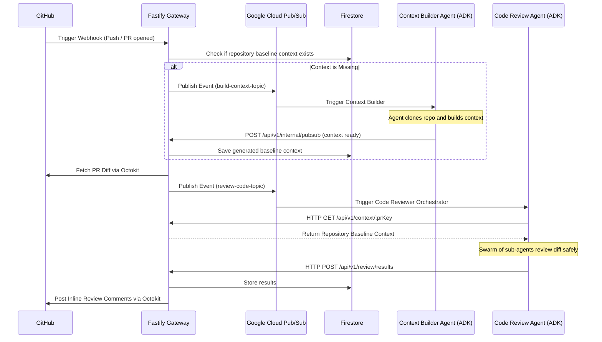

# Code Review Agent Architecture

This monorepo contains a fully autonomous, event-driven Code Review system powered by `@google/adk`. It consists of a central **Fastify Gateway** and two AI agent microservices (**Context Builder** and **Code Reviewer**).

## The Idea & Logic

The core idea is to perform highly accurate AI code reviews by maintaining a deep **baseline repository context**. A common problem with AI code reviewers is they only see the specific PR diff and hallucinate comments because they don't understand the broader repository architecture, utilities, and testing patterns.

Our system solves this by introducing a **Context Builder Agent**. 
When a Pull Request is opened:
1. **Smart Routing**: The Gateway intercepts the GitHub Webhook and checks Firestore to see if the repository's "baseline context" has already been built.
2. **Context Building**: If the baseline does not exist, the Gateway pauses the review and triggers the **Context Builder Agent** via Pub/Sub. This agent clones the entire repository, chunks the files, generates intelligent summaries of the architecture/patterns using Google Gemini, and synthesizes a permanent baseline context document.
3. **Review Swarm**: Once the baseline is ready (or if it already existed), the Gateway fetches the PR diff and triggers the **Code Review Agent**. This agent acts as an orchestrator, spawning parallel sub-agents (Quality, Problems, Tickets) to review the diff against the deep baseline context.
4. **Actionable Output**: The orchestrator merges the findings into a precise JSON payload and sends it back to the Gateway, which uses Octokit to natively post the findings as inline review comments on GitHub.
5. **Continuous Learning**: When a PR is merged, the Gateway triggers an incremental baseline update, ensuring the Context Builder patches the baseline with the new code, keeping the AI's understanding up to date!

## Architecture Diagram



## Step-by-Step Deployment Guide

Follow these steps to deploy and run the system:

### 1. Prerequisites
- **Node.js** v20+
- **Google Cloud Platform** account (Firestore, Pub/Sub, Gemini API enabled)
- **GitHub App** or Personal Access Token with repository read/write and webhook access.

### 2. Environment Configuration
Create a `.env` file at the root of the workspace (or set these in your deployment environment):

```env
# Google Cloud
GOOGLE_CLOUD_PROJECT=your-gcp-project-id
GOOGLE_APPLICATION_CREDENTIALS=/path/to/service-account.json

# Pub/Sub Topics
BUILD_CONTEXT_TOPIC=build-context-topic
CONTEXT_READY_TOPIC=context-ready-topic
REVIEW_CODE_TOPIC=review-code-topic

# Server Ports
PORT=3000
HOST=0.0.0.0

# GitHub Integration
GITHUB_WEBHOOK_SECRET_ID=your-webhook-secret # Kept in Secret Manager
GITHUB_TOKEN_SECRET_ID=your-github-token     # Kept in Secret Manager
```

### 3. Google Cloud Pub/Sub Setup
Ensure you have created the three Pub/Sub topics listed above in your GCP project.
For local development, you can use the Google Cloud Pub/Sub Emulator. For production, you must set up push subscriptions:
- `context-ready-topic` pushes to `https://your-gateway-url.com/api/v1/internal/pubsub`
- `review-result-topic` pushes to `https://your-gateway-url.com/api/v1/review/results`

### 4. Build the Workspace
Compile all three applications in the Nx Monorepo:
```sh
npm install
npx nx run-many -t build
```

### 5. Running the Services
You need to run the three services concurrently (Gateway, Context Builder, and Code Reviewer).

**Start the Gateway:**
```sh
npx nx run gateway:serve
```

**Start the Context Builder Agent:**
```sh
npx nx run agent-context-builder:serve
```

**Start the Code Reviewer Agent:**
```sh
npx nx run agent-code-reviewer:serve
```

### 6. GitHub Webhook Setup
Go to your GitHub Repository (or Organization) Settings -> Webhooks.
- **Payload URL**: `https://your-gateway-url.com/api/v1/webhooks`
- **Content type**: `application/json`
- **Secret**: Match the webhook secret from your configuration.
- **Events**: Select `Pull requests` and `Issue comments`.

You are now fully deployed! Opening a Pull Request will automatically trigger the pipeline.
