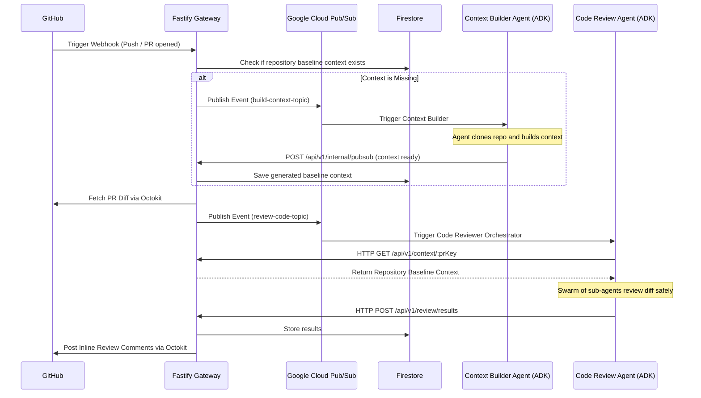

# Code Review Agent Architecture

This monorepo contains a fully autonomous, event-driven Code Review system powered by `@google/adk`. It consists of a central **Fastify Gateway** and two AI agent microservices (**Context Builder** and **Code Reviewer**).

## The Idea & Logic

The core idea is to perform highly accurate AI code reviews by maintaining a deep **baseline repository context**. A common problem with AI code reviewers is they only see the specific PR diff and hallucinate comments because they don't understand the broader repository architecture, utilities, and testing patterns.

Our system solves this by introducing a **Context Builder Agent**. 
When a Pull Request is opened:
1. **Smart Routing**: The Gateway intercepts the GitHub Webhook and checks Firestore to see if the repository's "baseline context" has already been built.
2. **Context Building**: If the baseline does not exist, the Gateway pauses the review and triggers the **Context Builder Agent** via Pub/Sub. This agent clones the entire repository, chunks the files, generates intelligent summaries of the architecture/patterns using Google Gemini, and synthesizes a permanent baseline context document.
3. **Review Swarm**: Once the baseline is ready (or if it already existed), the Gateway fetches the PR diff and triggers the **Code Review Agent**. This agent acts as an orchestrator, spawning parallel sub-agents (Quality, Problems, Tickets) to review the diff against the deep baseline context.
4. **Actionable Output**: The orchestrator merges the findings into a precise JSON payload and sends it back to the Gateway, which uses Octokit to natively post the findings as inline review comments on GitHub.
5. **Continuous Learning**: When a PR is merged, the Gateway triggers an incremental baseline update, ensuring the Context Builder patches the baseline with the new code, keeping the AI's understanding up to date!

## Architecture Diagram



## Step-by-Step Deployment Guide

Follow these steps to deploy and run the system:

### 1. Prerequisites
- **Node.js** v20+
- **Google Cloud Platform** account (Firestore, Pub/Sub, Gemini API enabled)
- **GitHub App** or Personal Access Token with repository read/write and webhook access.

### 2. Google Cloud Pub/Sub Setup
Ensure you have created the three Pub/Sub topics (`build-context-topic`, `context-ready-topic`, `review-code-topic`) in your GCP project.
Once the Gateway is deployed, you must set up push subscriptions. To ensure security, generate a random secret string (e.g., `PUBSUB_SECRET_TOKEN`) and append it as a query parameter:
- `context-ready-topic` pushes to `https://<YOUR_CLOUD_RUN_URL>/api/v1/internal/pubsub?token=<YOUR_PUBSUB_SECRET_TOKEN>`
- `review-result-topic` pushes to `https://<YOUR_CLOUD_RUN_URL>/api/v1/review/results?token=<YOUR_PUBSUB_SECRET_TOKEN>`

### 3. Automated CI/CD via Google Cloud Build

You have two options to deploy the agent: automated via GitHub, or manually via the GCP CLI.

#### Option A: Automated GitHub Triggers (Recommended)
We have configured a fully native Google Cloud CI/CD pipeline. 
To enable automated deployments using the modern (2nd Gen) integration:
1. Go to the **Cloud Build** console in Google Cloud.
2. Navigate to **Repositories (2nd gen)** and click **Create Host Connection**. Connect your GitHub account.
3. Link your specific repository to that connection.
4. Go to **Triggers** -> **Create Trigger**.
5. Select your 2nd gen repository, set the Event to **Push to a branch** (e.g., `main`), and set the configuration to point to `/cloudbuild.yaml`.

#### Option B: Manual Deployment via CLI
If you want to deploy directly from your local terminal without connecting GitHub to Google Cloud (perfect for deploying to a client's GCP account from your personal machine), you can submit the build manually:
1. Ensure you are authenticated with the correct GCP project locally: `gcloud config set project your-gcp-project-id`
2. Run the following command from the root of the repository:
   ```sh
   gcloud builds submit --config cloudbuild.yaml .
   ```
This will upload your local code to Cloud Build and execute the exact same deployment pipeline remotely!

### 4. Cloud Run Environment Configuration
After your first deployment, go to the Google Cloud Run console and ensure your Gateway service has the following environment variables configured:
- `GOOGLE_CLOUD_PROJECT`: your-gcp-project-id
- `BUILD_CONTEXT_TOPIC`: build-context-topic
- `CONTEXT_READY_TOPIC`: context-ready-topic
- `REVIEW_CODE_TOPIC`: review-code-topic
- `GITHUB_WEBHOOK_SECRET_ID`: your-webhook-secret (Reference to Secret Manager)
- `GITHUB_TOKEN_SECRET_ID`: your-github-token (Reference to Secret Manager)
- `PUBSUB_SECRET_TOKEN`: The random string you added to the push subscription URLs.

### 5. GitHub Webhook Setup
Finally, go to your GitHub Repository Settings -> Webhooks.
- **Payload URL**: `https://<YOUR_CLOUD_RUN_URL>/api/v1/webhooks`
- **Content type**: `application/json`
- **Secret**: Match the webhook secret stored in your GCP Secret Manager.
- **Events**: Select `Pull requests` and `Issue comments`.

You are now fully deployed on serverless Google Cloud infrastructure! Opening a Pull Request will automatically trigger the pipeline.
