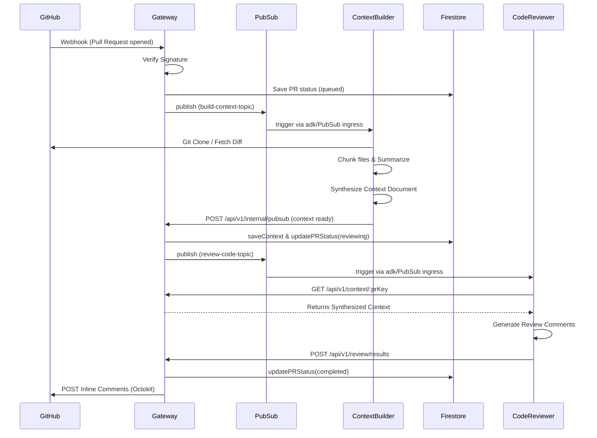
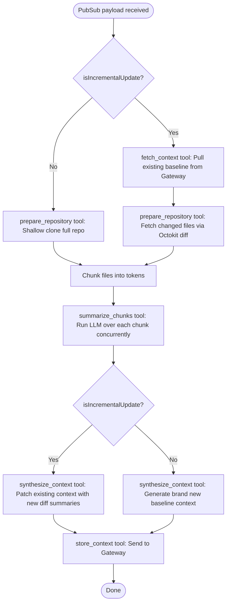

# Code Review Agent Architecture

This monorepo contains a custom, automated Code Review system that uses `@google/adk` to power two main autonomous agents (Context Builder & Code Reviewer) alongside a central Fastify Gateway.

## High-Level Architecture

The system coordinates between GitHub Webhooks, the Gateway, and Pub/Sub queues to safely build code context and generate expert code reviews.



## Context Builder Agent Details

The Context Builder Agent is responsible for maintaining a baseline understanding of the repository and extracting changes incrementally.



## Running the Project

```sh
# Start the Gateway
npm run start gateway
```
