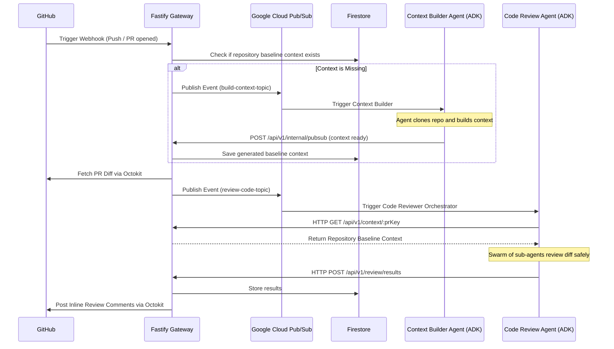

# Code Review Agent Architecture

This monorepo contains a fully autonomous, event-driven Code Review system powered by `@google/adk`. It consists of a central **Fastify Gateway** and two AI agent microservices (**Context Builder** and **Code Reviewer**).

## The Idea & Logic

The core idea is to perform highly accurate AI code reviews by maintaining a deep **baseline repository context**. A common problem with AI code reviewers is they only see the specific PR diff and hallucinate comments because they don't understand the broader repository architecture, utilities, and testing patterns.

Our system solves this by introducing a **Context Builder Agent**.
When a Pull Request is opened:

1. **Smart Routing**: The Gateway intercepts the GitHub Webhook and checks Firestore to see if the repository's "baseline context" has already been built.
2. **Context Building**: If the baseline does not exist, the Gateway pauses the review and triggers the **Context Builder Agent** via Pub/Sub. This agent clones the entire repository, chunks the files, generates intelligent summaries of the architecture/patterns using Google Gemini, and synthesizes a permanent baseline context document.
3. **Review Swarm**: Once the baseline is ready (or if it already existed), the Gateway fetches the PR diff and triggers the **Code Review Agent**. This agent acts as an orchestrator, spawning parallel sub-agents (Quality, Problems, Tickets) to review the diff against the deep baseline context.
4. **Actionable Output**: The orchestrator merges the findings into a precise JSON payload and sends it back to the Gateway, which uses Octokit to natively post the findings as inline review comments on GitHub.
5. **Continuous Learning**: When a PR is merged, the Gateway triggers an incremental baseline update, ensuring the Context Builder patches the baseline with the new code, keeping the AI's understanding up to date!

## Architecture Diagram


```mermaid
sequenceDiagram
    participant GitHub
    participant Gateway as Fastify Gateway
    participant PubSub as Google Cloud Pub/Sub
    participant DB as Firestore
    participant ContextAgent as Context Builder Agent (ADK)
    participant ReviewAgent as Code Review Agent (ADK)

    %% Webhook ingestion and DB check
    GitHub->>Gateway: Trigger Webhook (Push / PR opened)
    Gateway->>DB: Check if repository baseline context exists

    alt Context is Missing
        Gateway->>PubSub: Publish Event (build-context-topic)
        PubSub->>ContextAgent: Trigger Context Builder

        Note over ContextAgent: Agent clones repo and builds context

        ContextAgent->>Gateway: POST /api/v1/internal/pubsub (context ready)
        Gateway->>DB: Save generated baseline context
    end

    %% Code Review Workflow
    Gateway->>GitHub: Fetch PR Diff via Octokit
    Gateway->>PubSub: Publish Event (review-code-topic)
    PubSub->>ReviewAgent: Trigger Code Reviewer Orchestrator

    ReviewAgent->>Gateway: HTTP GET /api/v1/context/:prKey
    Gateway-->>ReviewAgent: Return Repository Baseline Context

    Note over ReviewAgent: Swarm of sub-agents review diff safely

    ReviewAgent->>Gateway: HTTP POST /api/v1/review/results
    Gateway->>DB: Store results
    Gateway->>GitHub: Post Inline Review Comments via Octokit
```

### Step-by-Step Deployment Guide

Deploying this distributed event-driven system involves provisioning infrastructure, building the codebase, and deploying the gateway and agents. We have fully automated this entire enterprise-grade process into an interactive deployment script!

### Prerequisites
- **Node.js** v20+
- **Google Cloud Platform** account (authenticated locally via `gcloud auth login`)
- **Terraform** and **gcloud CLI** installed locally.
- **Git Provider PAT** (Personal Access Token) with repository access.

### 1. Authenticate with Google Cloud
Ensure you are authenticated with GCP before starting:
```bash
gcloud auth login
```

### 2. Run the Deployment Script
From the root of the repository, run the interactive deploy script:
```bash
pnpm run deploy
```

The script will interactively ask you for your Google Cloud Project ID, region, API keys, and webhook secrets. 

**Under the hood, the script will strictly adhere to the following enterprise security pattern:**
1. Provision the empty Google Secret Manager containers using Terraform.
2. Securely inject your secrets using `gcloud secrets versions add` (keeping them completely out of your `terraform.tfstate`).
3. Compile the Nx workspace.
4. Deploy the Gateway and ADK Agents to Cloud Run using secure runtime secret injections.
5. Setup the Pub/Sub push subscriptions.

When the script finishes, it will print out the final Webhook Payload URL for you to configure in your Git repository settings!

### Manual Deployment Guide

If you prefer to deploy manually instead of using the automated script, follow these steps:

#### 1. Set Environment Variables
Set the following environment variables in your terminal:
```bash
export PROJECT_ID="your-gcp-project-id"
export REGION="us-central1"
export GIT_ADAPTER="github"
export GIT_ADAPTER_WEBHOOK_SECRET="your-random-webhook-secret"
export GIT_ADAPTER_TOKEN="your-git-personal-access-token"
export GEMINI_API_KEY="your-gemini-api-key"
export PUBSUB_SECRET_TOKEN="your-random-pubsub-secret"
export REVIEW_MODEL="gemini-3.1-pro"

# Set active project
gcloud config set project "$PROJECT_ID"
```

#### 2. Provision Infrastructure
Initialize and apply the Terraform configuration:
```bash
cd infra
terraform init
terraform apply -var="project_id=$PROJECT_ID" -var="region=$REGION" -auto-approve
cd ..
```

#### 3. Inject Secrets
Add the required secrets to Google Secret Manager:
```bash
echo -n "$GIT_ADAPTER_WEBHOOK_SECRET" | gcloud secrets versions add "git-adapter-webhook-secret" --data-file=- --project="$PROJECT_ID"
echo -n "$GIT_ADAPTER_TOKEN" | gcloud secrets versions add "git-adapter-token-secret" --data-file=- --project="$PROJECT_ID"
echo -n "$GEMINI_API_KEY" | gcloud secrets versions add "google-api-key" --data-file=- --project="$PROJECT_ID"
```

#### 4. Build the Workspace
Install dependencies and build the applications:
```bash
pnpm install
pnpm run build
```

#### 5. Deploy Fastify Gateway
Deploy the gateway to Cloud Run:
```bash
gcloud run deploy gateway-service \
  --source dist/apps/gateway \
  --region "$REGION" \
  --allow-unauthenticated \
  --set-env-vars "APP_NAME=gateway,BUILD_CONTEXT_TOPIC=build-context-topic,CONTEXT_READY_TOPIC=context-ready-topic,REVIEW_CODE_TOPIC=review-code-topic,PUBSUB_SECRET_TOKEN=$PUBSUB_SECRET_TOKEN,GIT_ADAPTER=$GIT_ADAPTER" \
  --set-secrets="GIT_ADAPTER_WEBHOOK_SECRET=git-adapter-webhook-secret:latest,GIT_ADAPTER_TOKEN=git-adapter-token-secret:latest" \
  --quiet

export GATEWAY_URL=$(gcloud run services describe gateway-service --region "$REGION" --format 'value(status.url)')
echo "Gateway URL: $GATEWAY_URL"
```

#### 6. Deploy AI Agents
Deploy the Context Builder and Code Reviewer agents:
```bash
# Deploy Context Builder
npx adk deploy cloud_run dist/apps/agent-context-builder --project "$PROJECT_ID" --service_name agent-context-builder --region "$REGION"
gcloud run services update agent-context-builder \
  --update-env-vars "GOOGLE_GENAI_USE_VERTEXAI=0,GATEWAY_URL=$GATEWAY_URL,REVIEW_MODEL=$REVIEW_MODEL,GIT_ADAPTER=$GIT_ADAPTER" \
  --set-secrets="GEMINI_API_KEY=google-api-key:latest,GIT_ADAPTER_TOKEN=git-adapter-token-secret:latest" \
  --region "$REGION" --quiet

# Deploy Code Reviewer
npx adk deploy cloud_run dist/apps/agent-code-reviewer --project "$PROJECT_ID" --service_name agent-code-reviewer --region "$REGION"
gcloud run services update agent-code-reviewer \
  --update-env-vars "GOOGLE_GENAI_USE_VERTEXAI=0,GATEWAY_URL=$GATEWAY_URL,REVIEW_MODEL=$REVIEW_MODEL,GIT_ADAPTER=$GIT_ADAPTER" \
  --set-secrets="GEMINI_API_KEY=google-api-key:latest,GIT_ADAPTER_TOKEN=git-adapter-token-secret:latest" \
  --region "$REGION" --quiet
```

#### 7. Wire Up Pub/Sub Subscriptions
Create the push subscriptions for the gateway:
```bash
gcloud pubsub subscriptions create context-ready-sub \
  --topic=context-ready-topic \
  --push-endpoint="$GATEWAY_URL/api/v1/internal/pubsub?token=$PUBSUB_SECRET_TOKEN" \
  --ack-deadline=600

gcloud pubsub subscriptions create review-result-sub \
  --topic=review-result-topic \
  --push-endpoint="$GATEWAY_URL/api/v1/review/results?token=$PUBSUB_SECRET_TOKEN" \
  --ack-deadline=600
```
