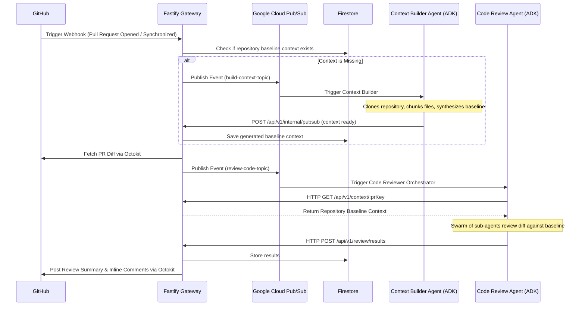

# Code Review Agent 🤖

A fully autonomous, context-aware AI Code Review system powered by [`@google/adk`](https://github.com/google/adk) and Google Gemini.

`code-review-agent` combines a high-performance **Fastify Gateway** with two specialized AI agent microservices (**Context Builder** and **Code Reviewer**). Rather than analyzing pull requests in isolation, it builds a deep repository baseline context so code reviews understand your broader system architecture, patterns, and libraries.

---

## 🌟 Key Features

- **Context-Aware Reviews**: Automatically generates and continuously updates a full baseline architectural context of your codebase to eliminate hallucinations.
- **Agentic Multi-Role Swarm**: Spawns parallel specialized reviewers (Code Quality, Bug Detection, Ticket Alignment) using `@google/adk`.
- **Top-Level Summaries & Inline Comments**: Submits formal top-level pull request reviews (with overall verdict, ticket alignment analysis, and defect counts) alongside actionable inline review comments.
- **Container-First & Open-Source**: Decoupled from any specific infrastructure or IaC tool. Packaged into production-grade multi-architecture Docker containers published to GitHub Container Registry (`ghcr.io`).
- **Flexible Deployment**: Run locally with Docker Compose, deploy serverlessly to Google Cloud Run, or orchestrate with Kubernetes or any container runtime.

---

## 🏗️ Architecture


```mermaid
sequenceDiagram
    participant GitHub
    participant Gateway as Fastify Gateway
    participant PubSub as Google Cloud Pub/Sub
    participant DB as Firestore
    participant ContextAgent as Context Builder Agent (ADK)
    participant ReviewAgent as Code Review Agent (ADK)

    %% Webhook ingestion and DB check
    GitHub->>Gateway: Trigger Webhook (Pull Request Opened / Synchronized)
    Gateway->>DB: Check if repository baseline context exists

    alt Context is Missing
        Gateway->>PubSub: Publish Event (build-context-topic)
        PubSub->>ContextAgent: Trigger Context Builder
        Note over ContextAgent: Clones repository, chunks files, synthesizes baseline
        ContextAgent->>Gateway: POST /api/v1/internal/pubsub (context ready)
        Gateway->>DB: Save generated baseline context
    end

    %% Code Review Workflow
    Gateway->>GitHub: Fetch PR Diff via Octokit
    Gateway->>PubSub: Publish Event (review-code-topic)
    PubSub->>ReviewAgent: Trigger Code Reviewer Orchestrator

    ReviewAgent->>Gateway: HTTP GET /api/v1/context/:prKey
    Gateway-->>ReviewAgent: Return Repository Baseline Context

    Note over ReviewAgent: Swarm of sub-agents review diff against baseline

    ReviewAgent->>Gateway: HTTP POST /api/v1/review/results
    Gateway->>DB: Store results
    Gateway->>GitHub: Post Review Summary & Inline Comments via Octokit
```

---

## 📦 Published Container Images

Every merge to `main` and version tag publishes multi-architecture (`linux/amd64`, `linux/arm64`) images to the GitHub Container Registry:

| Service | Image | Description |
| :--- | :--- | :--- |
| **Gateway** | `ghcr.io/<owner>/code-review-agent-gateway:latest` | Webhook ingestion, Firestore state, GitHub commenting |
| **Context Builder** | `ghcr.io/<owner>/code-review-agent-context-builder:latest` | ADK agent for repo indexing & baseline context |
| **Code Reviewer** | `ghcr.io/<owner>/code-review-agent-code-reviewer:latest` | ADK agent for diff analysis & inline suggestions |

---

## 🚀 Quickstart: Local Development

You can run the entire system locally using Docker Compose, which includes Firestore and Pub/Sub emulators:

```bash
# 1. Clone the repository
git clone https://github.com/<owner>/code-review-agent.git
cd code-review-agent

# 2. Copy and customize the environment file
cp .env.example .env

# 3. Start the stack with Docker Compose
docker compose up --build
```

The Gateway will be available at `http://localhost:3000` with healthchecks at `http://localhost:3000/healthz`.

---

## ☁️ Deployment Guide (Google Cloud Run / Kubernetes / Containers)

Deploying `code-review-agent` requires:
1. **Firestore Database** (Native Mode) for saving repository context baselines and pull request review states.
2. **Pub/Sub Topics**: `build-context-topic`, `context-ready-topic`, `review-code-topic`, `review-result-topic`.
3. **Secret Storage**: GitHub Webhook Secret, GitHub Personal Access Token, and Gemini API Key (or Vertex AI IAM credentials).

### 1. Setup Topics & Firestore (Using gcloud CLI)

```bash
export PROJECT_ID="YOUR_GCP_PROJECT_ID"
export REGION="us-central1"
export OWNER="<your-github-username>"

# Enable Required Google Cloud APIs
gcloud services enable run.googleapis.com pubsub.googleapis.com firestore.googleapis.com secretmanager.googleapis.com

# Create Firestore Database (Native mode)
gcloud firestore databases create --location="$REGION" --type=firestore-native || true

# Create Pub/Sub Topics
gcloud pubsub topics create build-context-topic || true
gcloud pubsub topics create context-ready-topic || true
gcloud pubsub topics create review-code-topic || true
gcloud pubsub topics create review-result-topic || true
```

### 2. Deploy Prebuilt Containers to Cloud Run

Deploy directly using the published container images from `ghcr.io`:

```bash
# 1. Deploy Gateway
gcloud run deploy gateway-service \
  --image "ghcr.io/$OWNER/code-review-agent-gateway:latest" \
  --region "$REGION" \
  --allow-unauthenticated \
  --set-env-vars "APP_NAME=gateway,BUILD_CONTEXT_TOPIC=build-context-topic,CONTEXT_READY_TOPIC=context-ready-topic,REVIEW_CODE_TOPIC=review-code-topic,PUBSUB_SECRET_TOKEN=YOUR_INTERNAL_SECRET,GIT_ADAPTER=github,GIT_ADAPTER_WEBHOOK_SECRET=YOUR_WEBHOOK_SECRET,GIT_ADAPTER_TOKEN=ghp_YOUR_TOKEN"

# Capture Gateway URL
GATEWAY_URL=$(gcloud run services describe gateway-service --region "$REGION" --format 'value(status.url)')

# 2. Deploy Context Builder Agent
gcloud run deploy agent-context-builder \
  --image "ghcr.io/$OWNER/code-review-agent-context-builder:latest" \
  --region "$REGION" \
  --set-env-vars "GATEWAY_URL=$GATEWAY_URL,REVIEW_MODEL=gemini-2.5-flash,GEMINI_API_KEY=YOUR_GEMINI_KEY,GOOGLE_GENAI_USE_VERTEXAI=0"

# 3. Deploy Code Reviewer Agent
gcloud run deploy agent-code-reviewer \
  --image "ghcr.io/$OWNER/code-review-agent-code-reviewer:latest" \
  --region "$REGION" \
  --set-env-vars "GATEWAY_URL=$GATEWAY_URL,REVIEW_MODEL=gemini-2.5-flash,GEMINI_API_KEY=YOUR_GEMINI_KEY,GOOGLE_GENAI_USE_VERTEXAI=0"
```

> [!TIP]
> In production, use Google Secret Manager references (`--set-secrets`) or your cloud orchestrator's secret store instead of plain environment variables.

### 3. Wire Pub/Sub Push Subscriptions

Create the push subscriptions delivering events to your Gateway:

```bash
gcloud pubsub subscriptions create context-ready-sub \
  --topic=context-ready-topic \
  --push-endpoint="$GATEWAY_URL/api/v1/internal/pubsub?token=YOUR_INTERNAL_SECRET" \
  --ack-deadline=600

gcloud pubsub subscriptions create review-result-sub \
  --topic=review-result-topic \
  --push-endpoint="$GATEWAY_URL/api/v1/review/results?token=YOUR_INTERNAL_SECRET" \
  --ack-deadline=600
```

### 4. Configure GitHub Webhook

In your target GitHub repository (or organization):
- **Payload URL**: `https://<GATEWAY_URL>/api/v1/webhooks`
- **Content type**: `application/json`
- **Secret**: The secret matching `GIT_ADAPTER_WEBHOOK_SECRET`
- **Events**: Pull requests, Issue comments

---

---

## 🚀 Dedicated Deployment Repository (Recommended GitOps Pattern)

You do **not** need to fork or rebuild this entire monorepo in your other accounts. Because this repository publishes prebuilt, production-ready multi-architecture images to GitHub Packages (`ghcr.io`), you can manage your deployment using a separate, lightweight repository in your other GitHub account.

### 1. Structure of Your Deployment Repository

Create a new repository (e.g. `code-review-agent-deploy`) with this structure:

```
code-review-agent-deploy/
├── .github/
│   └── workflows/
│       └── deploy.yml          # GitHub Action to trigger / redeploy
├── docker-compose.prod.yml     # Pulls published images from ghcr.io
├── .env.example                # Configuration template
└── README.md
```

### 2. Ready-to-Use `docker-compose.prod.yml`

This file pulls the prebuilt images directly from `ghcr.io/usermeme`:

```yaml
version: '3.8'

services:
  gateway:
    image: ghcr.io/usermeme/code-review-agent-gateway:latest
    restart: always
    ports:
      - "80:8080"
    environment:
      - PORT=8080
      - HOST=0.0.0.0
      - GIT_ADAPTER=github
      - GIT_ADAPTER_WEBHOOK_SECRET=${GIT_ADAPTER_WEBHOOK_SECRET}
      - GIT_ADAPTER_TOKEN=${GIT_ADAPTER_TOKEN}
      - PUBSUB_SECRET_TOKEN=${PUBSUB_SECRET_TOKEN}
      - BUILD_CONTEXT_TOPIC=build-context-topic
      - CONTEXT_READY_TOPIC=context-ready-topic
      - REVIEW_CODE_TOPIC=review-code-topic
      - REVIEW_RESULT_TOPIC=review-result-topic
      - FIRESTORE_EMULATOR_HOST=firestore:8080
      - PUBSUB_EMULATOR_HOST=pubsub:8085
      - PUBSUB_PROJECT_ID=local-project
    depends_on:
      - firestore
      - pubsub

  agent-context-builder:
    image: ghcr.io/usermeme/code-review-agent-context-builder:latest
    restart: always
    environment:
      - PORT=8080
      - GATEWAY_URL=http://gateway:8080
      - REVIEW_MODEL=gemini-2.5-flash
      - GEMINI_API_KEY=${GEMINI_API_KEY}
      - PUBSUB_EMULATOR_HOST=pubsub:8085
      - PUBSUB_PROJECT_ID=local-project
    depends_on:
      - gateway
      - pubsub

  agent-code-reviewer:
    image: ghcr.io/usermeme/code-review-agent-code-reviewer:latest
    restart: always
    environment:
      - PORT=8080
      - GATEWAY_URL=http://gateway:8080
      - REVIEW_MODEL=gemini-2.5-flash
      - GEMINI_API_KEY=${GEMINI_API_KEY}
      - PUBSUB_EMULATOR_HOST=pubsub:8085
      - PUBSUB_PROJECT_ID=local-project
    depends_on:
      - gateway
      - pubsub

  firestore:
    image: google/cloud-sdk:emulators
    command: gcloud beta emulators firestore start --host-port=0.0.0.0:8080

  pubsub:
    image: google/cloud-sdk:emulators
    command: gcloud beta emulators pubsub start --host-port=0.0.0.0:8085 --project=local-project

  pubsub-init:
    image: google/cloud-sdk:emulators
    depends_on:
      - pubsub
      - gateway
    entrypoint: >
      bash -c "
        while ! curl -s http://pubsub:8085 > /dev/null; do sleep 1; done;
        curl -s -X PUT http://pubsub:8085/v1/projects/local-project/topics/build-context-topic;
        curl -s -X PUT http://pubsub:8085/v1/projects/local-project/topics/context-ready-topic;
        curl -s -X PUT http://pubsub:8085/v1/projects/local-project/topics/review-code-topic;
        curl -s -X PUT http://pubsub:8085/v1/projects/local-project/topics/review-result-topic;
        curl -s -X PUT http://pubsub:8085/v1/projects/local-project/subscriptions/context-ready-sub \
          -H 'Content-Type: application/json' \
          -d '{\"topic\":\"projects/local-project/topics/context-ready-topic\",\"pushConfig\":{\"pushEndpoint\":\"http://gateway:8080/api/v1/internal/pubsub?token=${PUBSUB_SECRET_TOKEN}\"}}';
        curl -s -X PUT http://pubsub:8085/v1/projects/local-project/subscriptions/review-result-sub \
          -H 'Content-Type: application/json' \
          -d '{\"topic\":\"projects/local-project/topics/review-result-topic\",\"pushConfig\":{\"pushEndpoint\":\"http://gateway:8080/api/v1/review/results?token=${PUBSUB_SECRET_TOKEN}\"}}';
      "
```

### 3. Deploy Workflow (`.github/workflows/deploy.yml`)

Add an automated workflow in your deployment repository to trigger redeployments on push or manually via GitHub Actions:

```yaml
name: Deploy Code Review Agent

on:
  push:
    branches: [main]
  workflow_dispatch:

jobs:
  deploy:
    runs-on: ubuntu-latest
    steps:
      - name: Checkout Deployment Repo
        uses: actions/checkout@v4

      - name: Deploy to Remote Host via SSH
        uses: appleboy/ssh-action@master
        with:
          host: ${{ secrets.SERVER_HOST }}
          username: ${{ secrets.SERVER_USER }}
          key: ${{ secrets.SERVER_SSH_KEY }}
          envs: GEMINI_API_KEY,GIT_ADAPTER_TOKEN,GIT_ADAPTER_WEBHOOK_SECRET,PUBSUB_SECRET_TOKEN
          script: |
            cd /opt/code-review-agent-deploy
            git pull origin main
            docker compose -f docker-compose.prod.yml pull
            docker compose -f docker-compose.prod.yml up -d --remove-orphans
```

### 4. Secret Configuration

Configure your credentials in **Settings** → **Secrets and variables** → **Actions** in your deployment repository:
- `GEMINI_API_KEY`: API key from [Google AI Studio](https://aistudio.google.com/app/apikey).
- `GIT_ADAPTER_TOKEN`: Personal Access Token from your GitHub account (with `repo` permissions).
- `GIT_ADAPTER_WEBHOOK_SECRET`: Secret used to authenticate GitHub webhooks.
- `PUBSUB_SECRET_TOKEN`: Shared secret for internal gateway push callbacks.

A single running instance can review PRs across any repository and owner that your `GIT_ADAPTER_TOKEN` has permission to access.

---

## 🛠️ Local Development & Testing

```bash
# Install dependencies
pnpm install

# Run linters and typechecks
pnpm run lint
pnpm run typecheck

# Run unit tests
pnpm run test

# Run end-to-end BDD tests (Cucumber / Gherkin)
pnpm run e2e

# Build all applications with Nx
pnpm run build
```

---

## 📄 License

MIT
