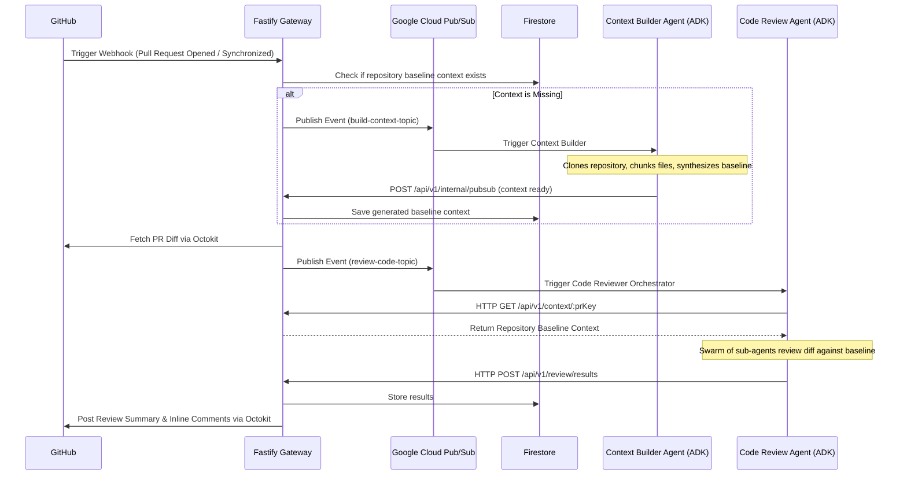

# Code Review Agent 🤖

A fully autonomous, context-aware AI Code Review system powered by [`@google/adk`](https://github.com/google/adk) and Google Gemini.

`code-review-agent` combines a high-performance **Fastify Gateway** with two specialized AI agent microservices (**Context Builder** and **Code Reviewer**). Rather than analyzing pull requests in isolation, it builds a deep repository baseline context so code reviews understand your broader system architecture, patterns, and libraries.

---

## 🌟 Key Features

- **Context-Aware Reviews**: Automatically generates and continuously updates a full baseline architectural context of your codebase to eliminate hallucinations.
- **Agentic Multi-Role Swarm**: Spawns parallel specialized reviewers (Code Quality, Bug Detection, Ticket Alignment) using `@google/adk`.
- **Top-Level Summaries & Inline Comments**: Submits formal top-level pull request reviews (with overall verdict, ticket alignment analysis, and defect counts) alongside actionable inline review comments.
- **Container-First & Open-Source**: Decoupled from any specific infrastructure or IaC tool. Packaged into production-grade multi-architecture Docker containers published to GitHub Container Registry (`ghcr.io`).
- **Flexible Deployment**: Run locally with Docker Compose, deploy serverlessly to Google Cloud Run, or orchestrate with Kubernetes or any container runtime.

---

## 🏗️ Architecture


```mermaid
sequenceDiagram
    participant GitHub
    participant Gateway as Fastify Gateway
    participant PubSub as Google Cloud Pub/Sub
    participant DB as Firestore
    participant ContextAgent as Context Builder Agent (ADK)
    participant ReviewAgent as Code Review Agent (ADK)

    %% Webhook ingestion and DB check
    GitHub->>Gateway: Trigger Webhook (Pull Request Opened / Synchronized)
    Gateway->>DB: Check if repository baseline context exists

    alt Context is Missing
        Gateway->>PubSub: Publish Event (build-context-topic)
        PubSub->>ContextAgent: Trigger Context Builder
        Note over ContextAgent: Clones repository, chunks files, synthesizes baseline
        ContextAgent->>Gateway: POST /api/v1/internal/pubsub (context ready)
        Gateway->>DB: Save generated baseline context
    end

    %% Code Review Workflow
    Gateway->>GitHub: Fetch PR Diff via Octokit
    Gateway->>PubSub: Publish Event (review-code-topic)
    PubSub->>ReviewAgent: Trigger Code Reviewer Orchestrator

    ReviewAgent->>Gateway: HTTP GET /api/v1/context/:prKey
    Gateway-->>ReviewAgent: Return Repository Baseline Context

    Note over ReviewAgent: Swarm of sub-agents review diff against baseline

    ReviewAgent->>Gateway: HTTP POST /api/v1/review/results
    Gateway->>DB: Store results
    Gateway->>GitHub: Post Review Summary & Inline Comments via Octokit
```

---

## 📦 Published Container Images

Every merge to `main` and version tag publishes multi-architecture (`linux/amd64`, `linux/arm64`) images to the GitHub Container Registry:

| Service | Image | Description |
| :--- | :--- | :--- |
| **Gateway** | `ghcr.io/<owner>/code-review-agent-gateway:latest` | Webhook ingestion, Firestore state, GitHub commenting |
| **Context Builder** | `ghcr.io/<owner>/code-review-agent-context-builder:latest` | ADK agent for repo indexing & baseline context |
| **Code Reviewer** | `ghcr.io/<owner>/code-review-agent-code-reviewer:latest` | ADK agent for diff analysis & inline suggestions |

---

## 🚀 Quickstart: Local Development

You can run the entire system locally using Docker Compose, which includes Firestore and Pub/Sub emulators:

```bash
# 1. Clone the repository
git clone https://github.com/<owner>/code-review-agent.git
cd code-review-agent

# 2. Copy and customize the environment file
cp .env.example .env

# 3. Start the stack with Docker Compose
docker compose up --build
```

The Gateway will be available at `http://localhost:3000` with healthchecks at `http://localhost:3000/healthz`.

---

## ☁️ Deployment Guide (Google Cloud Run / Kubernetes / Containers)

Deploying `code-review-agent` requires:
1. **Firestore Database** (Native Mode) for saving repository context baselines and pull request review states.
2. **Pub/Sub Topics**: `build-context-topic`, `context-ready-topic`, `review-code-topic`, `review-result-topic`.
3. **Secret Storage**: GitHub Webhook Secret, GitHub Personal Access Token, and Gemini API Key (or Vertex AI IAM credentials).

### 1. Setup Infrastructure via Script

Run the automated setup script to enable APIs, create the native Firestore database, and provision the Pub/Sub topics:

```bash
export PROJECT_ID="YOUR_GCP_PROJECT_ID"
export REGION="us-central1"
export PUBSUB_SECRET_TOKEN="$(openssl rand -hex 20)"

bash scripts/setup-gcp-infra.sh
```

### 2. Automated Deployment via GitHub Actions (Recommended)

This repository includes a turnkey GitHub Actions workflow ([`.github/workflows/deploy-cloudrun.yml`](.github/workflows/deploy-cloudrun.yml)) that builds and deploys all 3 services and automatically wires push subscriptions to the live Gateway URL.

#### Required GitHub Secrets
In your GitHub repository, navigate to **Settings** → **Secrets and variables** → **Actions** and add:

| Secret | Description |
| :--- | :--- |
| `GCP_PROJECT_ID` | Your Google Cloud Project ID |
| `GCP_SA_KEY` | JSON key of a Service Account with Cloud Run Admin, Pub/Sub Editor, and Service Account User roles |
| `GEMINI_API_KEY` | API Key from [Google AI Studio](https://aistudio.google.com/app/apikey) |
| `GIT_ADAPTER_TOKEN` | GitHub Personal Access Token (classic) with `repo` permissions |
| `GIT_ADAPTER_WEBHOOK_SECRET` | Secret string for verifying incoming webhooks |
| `PUBSUB_SECRET_TOKEN` | Secret string matching your `setup-gcp-infra.sh` token |

Once configured, either:
- Push code to `main` (deploys after container release builds succeed).
- Or click **Actions** → **Deploy to Google Cloud Run** → **Run workflow**.

### 3. Manual Deployment (Alternative via gcloud CLI)

If deploying manually from your terminal:

```bash
export PROJECT_ID="YOUR_GCP_PROJECT_ID"
export REGION="us-central1"
export OWNER="<your-github-username-or-org>"

# 1. Deploy Gateway
gcloud run deploy gateway-service \
  --image "ghcr.io/$OWNER/code-review-agent-gateway:latest" \
  --region "$REGION" \
  --project "$PROJECT_ID" \
  --allow-unauthenticated \
  --set-env-vars "APP_NAME=gateway,PORT=8080,HOST=0.0.0.0,BUILD_CONTEXT_TOPIC=build-context-topic,CONTEXT_READY_TOPIC=context-ready-topic,REVIEW_CODE_TOPIC=review-code-topic,REVIEW_RESULT_TOPIC=review-result-topic,GIT_ADAPTER=github,GIT_ADAPTER_WEBHOOK_SECRET=$GIT_ADAPTER_WEBHOOK_SECRET,GIT_ADAPTER_TOKEN=$GIT_ADAPTER_TOKEN,PUBSUB_SECRET_TOKEN=$PUBSUB_SECRET_TOKEN"

# 2. Capture Gateway URL and wire push subscriptions
GATEWAY_URL=$(gcloud run services describe gateway-service --region "$REGION" --project "$PROJECT_ID" --format 'value(status.url)')
GATEWAY_URL="$GATEWAY_URL" PUBSUB_SECRET_TOKEN="$PUBSUB_SECRET_TOKEN" bash scripts/setup-gcp-infra.sh

# 3. Deploy Context Builder Agent
gcloud run deploy agent-context-builder \
  --image "ghcr.io/$OWNER/code-review-agent-context-builder:latest" \
  --region "$REGION" \
  --project "$PROJECT_ID" \
  --no-allow-unauthenticated \
  --set-env-vars "GATEWAY_URL=$GATEWAY_URL,REVIEW_MODEL=gemini-2.5-flash,GEMINI_API_KEY=$GEMINI_API_KEY,GOOGLE_GENAI_USE_VERTEXAI=0"

# 4. Deploy Code Reviewer Agent
gcloud run deploy agent-code-reviewer \
  --image "ghcr.io/$OWNER/code-review-agent-code-reviewer:latest" \
  --region "$REGION" \
  --project "$PROJECT_ID" \
  --no-allow-unauthenticated \
  --set-env-vars "GATEWAY_URL=$GATEWAY_URL,REVIEW_MODEL=gemini-2.5-flash,GEMINI_API_KEY=$GEMINI_API_KEY,GOOGLE_GENAI_USE_VERTEXAI=0"
```

### 4. Configure GitHub Webhook

In your target GitHub repository (or organization):
- **Payload URL**: `https://<GATEWAY_URL>/api/v1/webhooks`
- **Content type**: `application/json`
- **Secret**: The secret matching `GIT_ADAPTER_WEBHOOK_SECRET`
- **Events**: Pull requests, Issue comments

---

## 🏢 Enterprise & Organization Deployments

This repository is designed as a decoupled upstream artifact publisher. To deploy within your organization:

1. **Pull Pre-built Containers**: Use `ghcr.io/<owner>/code-review-agent-gateway:latest`, `ghcr.io/<owner>/code-review-agent-context-builder:latest`, and `ghcr.io/<owner>/code-review-agent-code-reviewer:latest` directly in your organization's deployment pipeline (Kubernetes / Helm, Cloud Run, ECS, Nomad, or Docker Compose).
2. **Inject Secrets Securely**: Supply runtime secrets (`GEMINI_API_KEY`, `GIT_ADAPTER_TOKEN`, `GIT_ADAPTER_WEBHOOK_SECRET`, `PUBSUB_SECRET_TOKEN`) via your platform's native secret manager (e.g. Google Secret Manager, HashiCorp Vault, AWS Secrets Manager).
3. **Automate Updates via GitOps**: Use standard GitOps tooling (such as ArgoCD, Flux, Renovate, or an internal CI/CD pipeline) in your private infrastructure repository to track semantic version tags published by this project's release workflow.

---

## 🛠️ Local Development & Testing

```bash
# Install dependencies
pnpm install

# Run linters and typechecks
pnpm run lint
pnpm run typecheck

# Run unit tests
pnpm run test

# Run end-to-end BDD tests (Cucumber / Gherkin)
pnpm run e2e

# Build all applications with Nx
pnpm run build
```

---

## 📄 License

MIT
