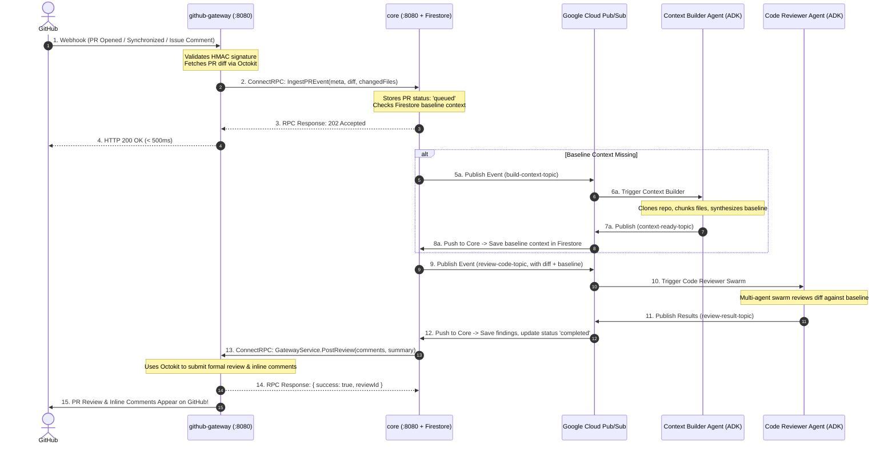

# Code Review Agent 🤖

A fully autonomous, context-aware AI Code Review system powered by [`@google/adk`](https://github.com/google/adk) and Google Gemini.

`code-review-agent` follows a decoupled, secure event-driven microservices architecture featuring provider-specific gateways (**`github-gateway`**), a centralized domain & persistence microservice (**`core`**), and two specialized AI agent microservices (**`agent-context-builder`** and **`agent-code-reviewer`**). Gateways are completely isolated from the database, communicating with Core via typed ConnectRPC, while heavy AI tasks run asynchronously over Google Cloud Pub/Sub.

---

## 🌟 Key Features

- **Strict Security Boundaries**: Gateways have zero database access or credentials. Core holds zero Git access tokens.
- **Pluggable Multi-Gateway Architecture**: Easily swap or add provider gateways (GitHub, GitLab, Bitbucket) implementing common ConnectRPC contracts.
- **Context-Aware Reviews**: Automatically generates and continuously updates a full baseline architectural context of your codebase to eliminate hallucinations.
- **Agentic Multi-Role Swarm**: Spawns parallel specialized reviewers (Code Quality, Bug Detection, Ticket Alignment) using `@google/adk`.
- **Top-Level Summaries & Inline Comments**: Submits formal pull request reviews alongside actionable inline review comments directly to the Git provider.
- **Fail-Fast Environment Configuration**: Strict validation with zero silent default fallbacks on required environment variables.
- **Container-First CI/CD**: Clean separation between application source code and private deployment operations. Multi-arch container images are automatically built and published to GHCR.

---

## 🏗️ Architecture


```mermaid
sequenceDiagram
    autonumber
    actor GitHub
    participant GW as github-gateway (:8080)
    participant Core as core (:8080 + Firestore)
    participant Bus as Google Cloud Pub/Sub
    participant CtxAgent as Context Builder Agent (ADK)
    participant RevAgent as Code Reviewer Agent (ADK)

    %% 1. Ingress
    GitHub->>GW: 1. Webhook (PR Opened / Synchronized / Issue Comment)
    Note over GW: Validates HMAC signature<br/>Fetches PR diff via Octokit
    GW->>Core: 2. ConnectRPC: IngestPREvent(meta, diff, changedFiles)
    Note over Core: Stores PR status: 'queued'<br/>Checks Firestore baseline context
    Core-->>GW: 3. RPC Response: 202 Accepted
    GW-->>GitHub: 4. HTTP 200 OK (< 500ms)

    %% 2. Context Orchestration
    alt Baseline Context Missing
        Core->>Bus: 5a. Publish Event (build-context-topic)
        Bus->>CtxAgent: 6a. Trigger Context Builder
        Note over CtxAgent: Clones repo, chunks files, synthesizes baseline
        CtxAgent->>Bus: 7a. Publish (context-ready-topic)
        Bus->>Core: 8a. Push to Core -> Save baseline context in Firestore
    end

    %% 3. Code Review
    Core->>Bus: 9. Publish Event (review-code-topic, with diff + baseline)
    Bus->>RevAgent: 10. Trigger Code Reviewer Swarm
    Note over RevAgent: Multi-agent swarm reviews diff against baseline
    RevAgent->>Bus: 11. Publish Results (review-result-topic)

    %% 4. Review Completion & Egress
    Bus->>Core: 12. Push to Core -> Save findings, update status 'completed'
    Core->>GW: 13. ConnectRPC: GatewayService.PostReview(comments, summary)
    Note over GW: Uses Octokit to submit formal review & inline comments
    GW-->>Core: 14. RPC Response: { success: true, reviewId }
    GW->>GitHub: 15. PR Review & Inline Comments Appear on GitHub!
```

---

## 📂 Repository Structure

This monorepo is managed with [Nx](https://nx.dev) and [pnpm](https://pnpm.io):

```
code-review-agent/
├── apps/
│   ├── github-gateway/          # Stateless GitHub webhook ingress & ConnectRPC egress
│   ├── github-gateway-e2e/      # Cucumber/Gherkin BDD integration tests for GitHub Gateway
│   ├── core/                    # Domain logic, Firestore persistence & Pub/Sub orchestration
│   ├── core-e2e/                # Cucumber/Gherkin BDD integration tests for Core
│   ├── agent-context-builder/   # ADK agent for repo indexing & baseline context
│   └── agent-code-reviewer/     # ADK agent for diff review & inline findings
├── libs/
│   ├── env/                     # Type-safe environment manager with eager Zod schema validation
│   ├── contracts/               # Protobuf schemas & ConnectRPC client/server contracts
│   └── shared-types/            # Common domain TypeScript interfaces & schemas
├── .github/
│   └── workflows/
│       ├── ci.yml               # Lint, typecheck, unit tests, E2E tests, build dry-runs
│       └── release.yml          # Builds & publishes multi-arch container images to GHCR
└── docker-compose.yml           # Complete local development stack with emulators
```

---

## 📦 Published Container Images

Every merge to `main` and version tag (`v*.*.*`) automatically publishes multi-architecture (`linux/amd64`, `linux/arm64`) images to GitHub Container Registry (GHCR):

| Service | Container Image | Description |
| :--- | :--- | :--- |
| **GitHub Gateway** | `ghcr.io/<owner>/code-review-agent-github-gateway:latest` | Stateless webhook receiver & ConnectRPC GitHub egress |
| **Core Service** | `ghcr.io/<owner>/code-review-agent-core:latest` | Firestore database state, workflow orchestration, ConnectRPC |
| **Context Builder** | `ghcr.io/<owner>/code-review-agent-context-builder:latest` | ADK agent for repo indexing & baseline context |
| **Code Reviewer** | `ghcr.io/<owner>/code-review-agent-code-reviewer:latest` | ADK agent for diff analysis & inline suggestions |

---

## 🚀 Quickstart: Local Development

You can run the entire system locally with Docker Compose, which includes Firestore and Pub/Sub emulators:

```bash
# 1. Clone the repository
git clone https://github.com/<owner>/code-review-agent.git
cd code-review-agent

# 2. Copy and customize the environment file
cp .env.example .env

# Edit .env with your Google Gemini API key and GitHub credentials:
# - GEMINI_API_KEY
# - GIT_ADAPTER_TOKEN
# - GIT_ADAPTER_WEBHOOK_SECRET

# 3. Start the entire stack
docker compose up --build
```

The services will be available locally:
- **GitHub Gateway**: `http://localhost:3000` (Healthcheck: `http://localhost:3000/healthz`)
- **Core Service**: `http://localhost:3001` (Healthcheck: `http://localhost:3001/healthz`)
- **Firestore Emulator**: `localhost:8081`
- **Pub/Sub Emulator**: `localhost:8085`

---

## 🏢 Production Deployment Strategy: Separate Private Ops Repo

### Why a Separate Private Deployment Repository?

This codebase is intentionally designed as an open-source / application repository that publishes versioned container images. We strongly recommend deploying via a **separate private repository** (e.g. `code-review-agent-deploy` or internal GitOps / infrastructure repo).

This approach provides:
1. **Security & Credential Isolation**: Keep cloud infrastructure credentials, service account keys, GitHub tokens, and `.env` secrets private.
2. **Infrastructure Independence**: Deploy to Google Cloud Run, GKE / Kubernetes (Helm / ArgoCD), AWS ECS, or self-hosted Docker Compose without modifying application code.
3. **Immutable Releases**: Pin deployments to specific immutable semantic tags (e.g. `:v1.2.0` or `:sha-<commit>`) published by this repository.

### Setting Up the Private Deployment Repository

A private deployment repository typically contains:

```
code-review-agent-deploy/ (Private Repo)
├── .github/workflows/
│   └── deploy.yml               # Deployment workflow (Cloud Run, K8s, or SSH/Docker)
├── environments/
│   ├── production.env           # Injected production secrets & config
│   └── staging.env
├── terraform/                   # Optional: GCP/AWS infrastructure provisioning
│   ├── firestore.tf
│   └── pubsub.tf
└── docker-compose.prod.yml       # Production Compose or Kubernetes manifests
```

#### Private Repo Recommended Layout

```text
code-review-agent-deploy/
├── .github/
│   └── workflows/
│       └── deploy.yml               # Automated Cloud Run deployment workflow (all 4 services)
├── scripts/
│   └── setup-gcp-infra.sh           # Idempotent GCP setup (APIs, Firestore, Pub/Sub topics, push subscriptions)
├── terraform/                       # Optional: Declarative Terraform configuration
│   ├── main.tf
│   ├── variables.tf
│   └── outputs.tf
├── docker-compose.prod.yml          # Production Compose for VM / on-premise deployments
├── .env.example                     # Reference template for production secrets & config
└── README.md                        # Deployment instructions & ops runbook
```

---

### 📋 Ready-to-Use Artifacts for Your Private Deployment Repo

#### 1. Cloud Run CI/CD Workflow (`.github/workflows/deploy.yml`)

This automated workflow deploys all 4 microservices to Cloud Run and configures the Pub/Sub push subscriptions with OIDC authentication:

```yaml
name: Deploy Code Review Agent to Cloud Run

on:
  workflow_dispatch:
  push:
    branches: [main]

env:
  GCP_REGION: ${{ vars.GCP_REGION || 'us-central1' }}
  GCP_PROJECT_ID: ${{ vars.GCP_PROJECT_ID }}
  IMAGE_OWNER: ${{ vars.IMAGE_OWNER }}
  IMAGE_TAG: ${{ vars.IMAGE_TAG || 'latest' }}

jobs:
  deploy:
    runs-on: ubuntu-latest
    steps:
      - name: Authenticate to Google Cloud
        uses: google-github-actions/auth@v2
        with:
          credentials_json: ${{ secrets.GCP_SA_KEY }}

      - name: Set up Cloud SDK
        uses: google-github-actions/setup-gcloud@v2

      # 1. Deploy Core Service
      - name: Deploy Core Service
        run: |
          gcloud run deploy core-service \
            --image "ghcr.io/${{ env.IMAGE_OWNER }}/code-review-agent-core:${{ env.IMAGE_TAG }}" \
            --region "${{ env.GCP_REGION }}" \
            --platform managed \
            --no-allow-unauthenticated \
            --service-account "code-review-agent-sa@${{ env.GCP_PROJECT_ID }}.iam.gserviceaccount.com" \
            --set-env-vars "PORT=8080,HOST=0.0.0.0,BUILD_CONTEXT_TOPIC=build-context-topic,CONTEXT_READY_TOPIC=context-ready-topic,REVIEW_CODE_TOPIC=review-code-topic,REVIEW_RESULT_TOPIC=review-result-topic,PUBSUB_SECRET_TOKEN=${{ secrets.PUBSUB_SECRET_TOKEN }},GOOGLE_CLOUD_PROJECT=${{ env.GCP_PROJECT_ID }}"

          CORE_URL=$(gcloud run services describe core-service --region "${{ env.GCP_REGION }}" --format 'value(status.url)')
          echo "CORE_URL=${CORE_URL}" >> $GITHUB_ENV

      # 2. Deploy Context Builder Agent (ADK)
      - name: Deploy Context Builder Agent
        run: |
          gcloud run deploy agent-context-builder \
            --image "ghcr.io/${{ env.IMAGE_OWNER }}/code-review-agent-context-builder:${{ env.IMAGE_TAG }}" \
            --region "${{ env.GCP_REGION }}" \
            --platform managed \
            --no-allow-unauthenticated \
            --memory 2Gi \
            --cpu 2 \
            --timeout 600s \
            --service-account "code-review-agent-sa@${{ env.GCP_PROJECT_ID }}.iam.gserviceaccount.com" \
            --set-env-vars "PORT=8080,CORE_URL=${{ env.CORE_URL }},REVIEW_MODEL=${{ vars.REVIEW_MODEL || 'gemini-2.5-flash' }},CONTEXT_READY_TOPIC=context-ready-topic,GIT_ADAPTER_TOKEN=${{ secrets.GIT_ADAPTER_TOKEN }},GEMINI_API_KEY=${{ secrets.GEMINI_API_KEY }},GOOGLE_CLOUD_PROJECT=${{ env.GCP_PROJECT_ID }}"

          CONTEXT_BUILDER_URL=$(gcloud run services describe agent-context-builder --region "${{ env.GCP_REGION }}" --format 'value(status.url)')
          echo "CONTEXT_BUILDER_URL=${CONTEXT_BUILDER_URL}" >> $GITHUB_ENV

      # 3. Deploy Code Reviewer Agent (ADK)
      - name: Deploy Code Reviewer Agent
        run: |
          gcloud run deploy agent-code-reviewer \
            --image "ghcr.io/${{ env.IMAGE_OWNER }}/code-review-agent-code-reviewer:${{ env.IMAGE_TAG }}" \
            --region "${{ env.GCP_REGION }}" \
            --platform managed \
            --no-allow-unauthenticated \
            --memory 2Gi \
            --cpu 2 \
            --timeout 600s \
            --service-account "code-review-agent-sa@${{ env.GCP_PROJECT_ID }}.iam.gserviceaccount.com" \
            --set-env-vars "PORT=8080,CORE_URL=${{ env.CORE_URL }},REVIEW_MODEL=${{ vars.REVIEW_MODEL || 'gemini-2.5-flash' }},REVIEW_RESULT_TOPIC=review-result-topic,PUBSUB_SECRET_TOKEN=${{ secrets.PUBSUB_SECRET_TOKEN }},GEMINI_API_KEY=${{ secrets.GEMINI_API_KEY }},GOOGLE_CLOUD_PROJECT=${{ env.GCP_PROJECT_ID }}"

          CODE_REVIEWER_URL=$(gcloud run services describe agent-code-reviewer --region "${{ env.GCP_REGION }}" --format 'value(status.url)')
          echo "CODE_REVIEWER_URL=${CODE_REVIEWER_URL}" >> $GITHUB_ENV

      # 4. Deploy GitHub Gateway (Public Ingress)
      - name: Deploy GitHub Gateway
        run: |
          gcloud run deploy github-gateway \
            --image "ghcr.io/${{ env.IMAGE_OWNER }}/code-review-agent-github-gateway:${{ env.IMAGE_TAG }}" \
            --region "${{ env.GCP_REGION }}" \
            --platform managed \
            --allow-unauthenticated \
            --service-account "code-review-agent-sa@${{ env.GCP_PROJECT_ID }}.iam.gserviceaccount.com" \
            --set-env-vars "PORT=8080,HOST=0.0.0.0,CORE_URL=${{ env.CORE_URL }},GIT_ADAPTER_WEBHOOK_SECRET=${{ secrets.GIT_ADAPTER_WEBHOOK_SECRET }},GIT_ADAPTER_TOKEN=${{ secrets.GIT_ADAPTER_TOKEN }},PUBSUB_SECRET_TOKEN=${{ secrets.PUBSUB_SECRET_TOKEN }}"

          GATEWAY_URL=$(gcloud run services describe github-gateway --region "${{ env.GCP_REGION }}" --format 'value(status.url)')
          echo "GATEWAY_URL=${GATEWAY_URL}" >> $GITHUB_ENV

      # 5. Link Gateway URL back to Core Service
      - name: Update Core Service with Gateway URL
        run: |
          gcloud run services update core-service \
            --region "${{ env.GCP_REGION }}" \
            --update-env-vars "GATEWAY_URL=${{ env.GATEWAY_URL }}"

      # 6. Configure Pub/Sub Push Subscriptions
      - name: Configure Pub/Sub Push Subscriptions
        run: |
          SA_EMAIL="code-review-agent-sa@${{ env.GCP_PROJECT_ID }}.iam.gserviceaccount.com"

          # Subscription 1: build-context-topic -> agent-context-builder
          gcloud pubsub subscriptions create build-context-sub \
            --topic=build-context-topic \
            --push-endpoint="${{ env.CONTEXT_BUILDER_URL }}/" \
            --push-auth-service-account="${SA_EMAIL}" \
            --ack-deadline=600 || \
          gcloud pubsub subscriptions update build-context-sub \
            --push-endpoint="${{ env.CONTEXT_BUILDER_URL }}/"

          # Subscription 2: context-ready-topic -> core
          gcloud pubsub subscriptions create context-ready-sub \
            --topic=context-ready-topic \
            --push-endpoint="${{ env.CORE_URL }}/api/v1/internal/pubsub?token=${{ secrets.PUBSUB_SECRET_TOKEN }}" \
            --push-auth-service-account="${SA_EMAIL}" \
            --ack-deadline=60 || \
          gcloud pubsub subscriptions update context-ready-sub \
            --push-endpoint="${{ env.CORE_URL }}/api/v1/internal/pubsub?token=${{ secrets.PUBSUB_SECRET_TOKEN }}"

          # Subscription 3: review-code-topic -> agent-code-reviewer
          gcloud pubsub subscriptions create review-code-sub \
            --topic=review-code-topic \
            --push-endpoint="${{ env.CODE_REVIEWER_URL }}/" \
            --push-auth-service-account="${SA_EMAIL}" \
            --ack-deadline=600 || \
          gcloud pubsub subscriptions update review-code-sub \
            --push-endpoint="${{ env.CODE_REVIEWER_URL }}/"

          # Subscription 4: review-result-topic -> core
          gcloud pubsub subscriptions create review-result-sub \
            --topic=review-result-topic \
            --push-endpoint="${{ env.CORE_URL }}/api/v1/review/results?token=${{ secrets.PUBSUB_SECRET_TOKEN }}" \
            --push-auth-service-account="${SA_EMAIL}" \
            --ack-deadline=60 || \
          gcloud pubsub subscriptions update review-result-sub \
            --push-endpoint="${{ env.CORE_URL }}/api/v1/review/results?token=${{ secrets.PUBSUB_SECRET_TOKEN }}"
```

---

#### 2. Infrastructure Setup Script (`scripts/setup-gcp-infra.sh`)

Run this idempotent script once in your private repo to initialize Firestore, Pub/Sub topics, and IAM permissions:

```bash
#!/usr/bin/env bash
set -euo pipefail

# Configuration
PROJECT_ID="${GCP_PROJECT_ID:-$(gcloud config get-value project)}"
REGION="${GCP_REGION:-us-central1}"
SA_NAME="code-review-agent-sa"
SA_EMAIL="${SA_NAME}@${PROJECT_ID}.iam.gserviceaccount.com"

echo "Setting up GCP infrastructure for Project: ${PROJECT_ID} in Region: ${REGION}..."

# 1. Enable required GCP APIs
echo "Enabling GCP APIs..."
gcloud services enable \
  run.googleapis.com \
  pubsub.googleapis.com \
  firestore.googleapis.com \
  iam.googleapis.com

# 2. Provision Firestore in Native mode (if not already existing)
echo "Checking Firestore database..."
if ! gcloud firestore databases describe --database="(default)" &>/dev/null; then
  echo "Creating Firestore (default) database in Native mode..."
  gcloud firestore databases create --location="${REGION}" --type=firestore-native
else
  echo "Firestore database already exists."
fi

# 3. Create Pub/Sub Topics
echo "Creating Pub/Sub topics..."
for TOPIC in build-context-topic context-ready-topic review-code-topic review-result-topic; do
  if ! gcloud pubsub topics describe "${TOPIC}" &>/dev/null; then
    gcloud pubsub topics create "${TOPIC}"
    echo "Created topic: ${TOPIC}"
  else
    echo "Topic ${TOPIC} already exists."
  fi
done

# 4. Create Service Account
echo "Configuring Service Account: ${SA_EMAIL}..."
if ! gcloud iam service-accounts describe "${SA_EMAIL}" &>/dev/null; then
  gcloud iam service-accounts create "${SA_NAME}" \
    --display-name="Code Review Agent Service Account"
fi

# 5. Grant IAM roles to Service Account
echo "Granting IAM roles to ${SA_EMAIL}..."
ROLES=(
  "roles/datastore.user"
  "roles/pubsub.publisher"
  "roles/run.invoker"
)
for ROLE in "${ROLES[@]}"; do
  gcloud projects add-iam-policy-binding "${PROJECT_ID}" \
    --member="serviceAccount:${SA_EMAIL}" \
    --role="${ROLE}" --quiet
done

# 6. Allow Pub/Sub service agent to create auth tokens for push subscriptions
PROJECT_NUMBER=$(gcloud projects describe "${PROJECT_ID}" --format='value(projectNumber)')
PUBSUB_SA="service-${PROJECT_NUMBER}@gcp-sa-pubsub.iam.gserviceaccount.com"
echo "Granting Service Account Token Creator to Pub/Sub SA: ${PUBSUB_SA}..."
gcloud iam service-accounts add-iam-policy-binding "${SA_EMAIL}" \
  --member="serviceAccount:${PUBSUB_SA}" \
  --role="roles/iam.serviceAccountTokenCreator" --quiet

echo "GCP Infrastructure setup complete! You are ready to deploy."
```

---

#### 3. Declarative Terraform Configuration (`terraform/main.tf`)

If your team prefers Terraform, include this in `terraform/main.tf`:

```hcl
terraform {
  required_version = ">= 1.5.0"
  required_providers {
    google = {
      source  = "hashicorp/google"
      version = "~> 5.0"
    }
  }
}

variable "project_id" {
  description = "Google Cloud Project ID"
  type        = string
}

variable "region" {
  description = "Default Google Cloud Region"
  type        = string
  default     = "us-central1"
}

provider "google" {
  project = var.project_id
  region  = var.region
}

# 1. Enable APIs
resource "google_project_service" "apis" {
  for_each = toset([
    "run.googleapis.com",
    "pubsub.googleapis.com",
    "firestore.googleapis.com",
    "iam.googleapis.com",
  ])
  service = each.key
  disable_on_destroy = false
}

# 2. Firestore Database
resource "google_firestore_database" "database" {
  name        = "(default)"
  location_id = var.region
  type        = "FIRESTORE_NATIVE"
  depends_on  = [google_project_service.apis]
}

# 3. Pub/Sub Topics
resource "google_pubsub_topic" "topics" {
  for_each = toset([
    "build-context-topic",
    "context-ready-topic",
    "review-code-topic",
    "review-result-topic",
  ])
  name       = each.key
  depends_on = [google_project_service.apis]
}

# 4. Service Account & IAM Roles
resource "google_service_account" "agent_sa" {
  account_id   = "code-review-agent-sa"
  display_name = "Code Review Agent Service Account"
}

resource "google_project_iam_member" "sa_roles" {
  for_each = toset([
    "roles/datastore.user",
    "roles/pubsub.publisher",
    "roles/run.invoker",
  ])
  project = var.project_id
  role    = each.key
  member  = "serviceAccount:${google_service_account.agent_sa.email}"
}

# 5. Allow Pub/Sub to mint OIDC tokens using agent service account
data "google_project" "current" {}

resource "google_service_account_iam_member" "pubsub_token_creator" {
  service_account_id = google_service_account.agent_sa.name
  role               = "roles/iam.serviceAccountTokenCreator"
  member             = "serviceAccount:service-${data.google_project.current.number}@gcp-sa-pubsub.iam.gserviceaccount.com"
}
```

---

#### 4. Docker Compose for Self-Hosted Deployments (`docker-compose.prod.yml`)

For teams running on a single cloud VM or on-premise Docker host:

```yaml
version: '3.8'

services:
  github-gateway:
    image: ghcr.io/<owner>/code-review-agent-github-gateway:latest
    restart: always
    ports:
      - "80:8080"
    environment:
      - PORT=8080
      - HOST=0.0.0.0
      - CORE_URL=http://core:8080
      - GIT_ADAPTER_WEBHOOK_SECRET=${GIT_ADAPTER_WEBHOOK_SECRET}
      - GIT_ADAPTER_TOKEN=${GIT_ADAPTER_TOKEN}
      - PUBSUB_SECRET_TOKEN=${PUBSUB_SECRET_TOKEN}
    depends_on:
      - core

  core:
    image: ghcr.io/<owner>/code-review-agent-core:latest
    restart: always
    environment:
      - PORT=8080
      - HOST=0.0.0.0
      - GATEWAY_URL=http://github-gateway:8080
      - PUBSUB_SECRET_TOKEN=${PUBSUB_SECRET_TOKEN}
      - BUILD_CONTEXT_TOPIC=build-context-topic
      - CONTEXT_READY_TOPIC=context-ready-topic
      - REVIEW_CODE_TOPIC=review-code-topic
      - REVIEW_RESULT_TOPIC=review-result-topic
      - GOOGLE_CLOUD_PROJECT=${GOOGLE_CLOUD_PROJECT}
    # Mount GCP service account credentials if running outside GCP:
    # volumes:
    #   - ./gcp-key.json:/secrets/gcp-key.json
    # environment:
    #   - GOOGLE_APPLICATION_CREDENTIALS=/secrets/gcp-key.json

  agent-context-builder:
    image: ghcr.io/<owner>/code-review-agent-context-builder:latest
    restart: always
    environment:
      - PORT=8080
      - CORE_URL=http://core:8080
      - REVIEW_MODEL=gemini-2.5-flash
      - GEMINI_API_KEY=${GEMINI_API_KEY}
      - CONTEXT_READY_TOPIC=context-ready-topic
      - GIT_ADAPTER_TOKEN=${GIT_ADAPTER_TOKEN}
      - GOOGLE_CLOUD_PROJECT=${GOOGLE_CLOUD_PROJECT}

  agent-code-reviewer:
    image: ghcr.io/<owner>/code-review-agent-code-reviewer:latest
    restart: always
    environment:
      - PORT=8080
      - CORE_URL=http://core:8080
      - REVIEW_MODEL=gemini-2.5-flash
      - GEMINI_API_KEY=${GEMINI_API_KEY}
      - REVIEW_RESULT_TOPIC=review-result-topic
      - PUBSUB_SECRET_TOKEN=${PUBSUB_SECRET_TOKEN}
      - GOOGLE_CLOUD_PROJECT=${GOOGLE_CLOUD_PROJECT}
```

---

### 🤖 Instructions to Pass to an Autonomous AI Agent

If you want an AI agent (such as Antigravity, Claude, Cursor, or Devin) to build and populate your private deployment repository from scratch, copy and paste this prompt:

````markdown
Please create a new private GitOps deployment repository named `code-review-agent-deploy` for the `code-review-agent` system.

The application publishes 4 multi-arch container images to GitHub Container Registry (GHCR):
- `ghcr.io/<owner>/code-review-agent-github-gateway:latest`
- `ghcr.io/<owner>/code-review-agent-core:latest`
- `ghcr.io/<owner>/code-review-agent-context-builder:latest`
- `ghcr.io/<owner>/code-review-agent-code-reviewer:latest`

Please generate the complete, production-ready repository with the following files:

1. `.github/workflows/deploy.yml`:
   - Deploys all 4 services to Google Cloud Run in this order: Core, Context Builder, Code Reviewer, Gateway.
   - Updates Core with the deployed Gateway URL.
   - Configures the 4 Pub/Sub push subscriptions with OIDC authentication using service account `code-review-agent-sa@<project>.iam.gserviceaccount.com`:
     - `build-context-sub` -> Agent Context Builder root (`/`)
     - `context-ready-sub` -> Core endpoint (`/api/v1/internal/pubsub?token=${PUBSUB_SECRET_TOKEN}`)
     - `review-code-sub` -> Agent Code Reviewer root (`/`)
     - `review-result-sub` -> Core endpoint (`/api/v1/review/results?token=${PUBSUB_SECRET_TOKEN}`)

2. `scripts/setup-gcp-infra.sh`:
   - Idempotent bash script to enable GCP APIs (`run`, `pubsub`, `firestore`, `iam`).
   - Creates Firestore native database `(default)`.
   - Creates the 4 Pub/Sub topics: `build-context-topic`, `context-ready-topic`, `review-code-topic`, `review-result-topic`.
   - Provisions `code-review-agent-sa` service account with `roles/datastore.user`, `roles/pubsub.publisher`, and `roles/run.invoker`.
   - Grants `roles/iam.serviceAccountTokenCreator` to the Pub/Sub service agent so push subscriptions can mint OIDC tokens.

3. `terraform/main.tf`, `terraform/variables.tf`, `terraform/outputs.tf`:
   - Full Terraform declarations equivalent to `setup-gcp-infra.sh`.

4. `docker-compose.prod.yml`:
   - Production Docker Compose setup running all 4 services referencing the GHCR images.

5. `.env.example`:
   - Complete template documenting all required secrets: `GIT_ADAPTER_WEBHOOK_SECRET`, `GIT_ADAPTER_TOKEN`, `PUBSUB_SECRET_TOKEN`, `GEMINI_API_KEY`, `GCP_PROJECT_ID`, and `GCP_REGION`.

6. `README.md`:
   - Step-by-step instructions on setting GitHub repository secrets/variables, running the infra setup, and triggering the deployment workflow.
````

## ⚙️ Environment Variables Reference

Each service strictly validates required variables and fails fast at startup if any are missing.

### GitHub Gateway (`apps/github-gateway`)

| Variable | Required | Description |
| :--- | :---: | :--- |
| `PORT` | Yes | Port to listen on (e.g. `8080`) |
| `HOST` | Yes | Host interface to bind to (e.g. `0.0.0.0`) |
| `CORE_URL` | Yes | HTTP base URL of the Core microservice for ConnectRPC communication |
| `GIT_ADAPTER_WEBHOOK_SECRET` | Yes | Secret string used to verify incoming GitHub webhook HMAC signatures |
| `GIT_ADAPTER_TOKEN` | Yes | GitHub Personal Access Token (classic with `repo` scope) for PR diffs & comments |
| `PUBSUB_SECRET_TOKEN` | Yes | Shared secret token for authenticating ConnectRPC requests from Core |

### Core Service (`apps/core`)

| Variable | Required | Description |
| :--- | :---: | :--- |
| `PORT` | Yes | Port to listen on (e.g. `8080`) |
| `HOST` | Yes | Host interface to bind to (e.g. `0.0.0.0`) |
| `GATEWAY_URL` | Yes | HTTP base URL of the Gateway microservice for ConnectRPC review posting |
| `PUBSUB_SECRET_TOKEN` | Yes | Shared secret token for authenticating ConnectRPC and internal push endpoints |
| `BUILD_CONTEXT_TOPIC` | Yes | Google Cloud Pub/Sub topic to publish context build requests to |
| `REVIEW_CODE_TOPIC` | Yes | Google Cloud Pub/Sub topic to publish code review tasks to |
| `CONTEXT_READY_TOPIC` | Optional | Google Cloud Pub/Sub topic for context ready notifications |
| `REVIEW_RESULT_TOPIC` | Optional | Google Cloud Pub/Sub topic for review result events |
| `GOOGLE_CLOUD_PROJECT` | Optional | GCP Project ID (auto-detected when running in GCP) |
| `FIRESTORE_EMULATOR_HOST`| Optional | Host of local Firestore emulator for dev/testing (e.g. `localhost:8081`) |
| `PUBSUB_EMULATOR_HOST` | Optional | Host of local Pub/Sub emulator for dev/testing (e.g. `localhost:8085`) |

### Context Builder Agent (`apps/agent-context-builder`)

| Variable | Required | Description |
| :--- | :---: | :--- |
| `PORT` | Yes | Port to listen on (e.g. `8080`) |
| `CORE_URL` | Yes | HTTP base URL of the Core microservice for fetching/saving context |
| `REVIEW_MODEL` | Yes | Gemini model identifier (e.g. `gemini-2.5-flash`) |
| `CONTEXT_READY_TOPIC` | Yes | Google Cloud Pub/Sub topic to publish completion event to |
| `GIT_ADAPTER_TOKEN` | Optional | GitHub Personal Access Token (classic with `repo` scope) to clone private repositories or fetch PR diffs |
| `GEMINI_API_KEY` | Optional | Google Gemini API key (required if not using Google Cloud ADC / Vertex AI) |
| `GOOGLE_GENAI_USE_VERTEXAI` | Optional | Set to `1` to authenticate via Google Cloud Vertex AI ADC |

### Code Reviewer Agent (`apps/agent-code-reviewer`)

| Variable | Required | Description |
| :--- | :---: | :--- |
| `PORT` | Yes | Port to listen on (e.g. `8080`) |
| `CORE_URL` | Yes | HTTP base URL of the Core microservice |
| `REVIEW_MODEL` | Yes | Gemini model identifier (e.g. `gemini-2.5-flash`) |
| `REVIEW_RESULT_TOPIC` | Yes | Google Cloud Pub/Sub topic to publish review findings to |
| `PUBSUB_SECRET_TOKEN` | Yes | Shared secret token for authenticating direct HTTP fallback to Core |
| `GEMINI_API_KEY` | Optional | Google Gemini API key (required if not using Google Cloud ADC / Vertex AI) |
| `GOOGLE_GENAI_USE_VERTEXAI` | Optional | Set to `1` to authenticate via Google Cloud Vertex AI ADC |

---

## 🔗 GitHub Webhook Configuration

In your GitHub repository (or organization) settings under **Webhooks** → **Add webhook**:
1. **Payload URL**: `https://<YOUR_GATEWAY_URL>/api/v1/webhooks`
2. **Content type**: `application/json`
3. **Secret**: Value matching `GIT_ADAPTER_WEBHOOK_SECRET`
4. **Events to trigger**:
   - `Pull requests`
   - `Issue comments`

---

## 🛠️ Monorepo Development Commands

```bash
# Install dependencies
pnpm install

# Run linting across all projects
pnpm run lint

# Run TypeScript typechecks across all projects
pnpm run typecheck

# Run unit tests across all projects
pnpm run test

# Run end-to-end BDD tests (Cucumber / Gherkin)
pnpm run e2e

# Build all microservices
pnpm run build

# Build individual Docker images locally
pnpm run docker:build:github-gateway
pnpm run docker:build:core
pnpm run docker:build:context-builder
pnpm run docker:build:code-reviewer
```

---

## 📄 License

MIT
