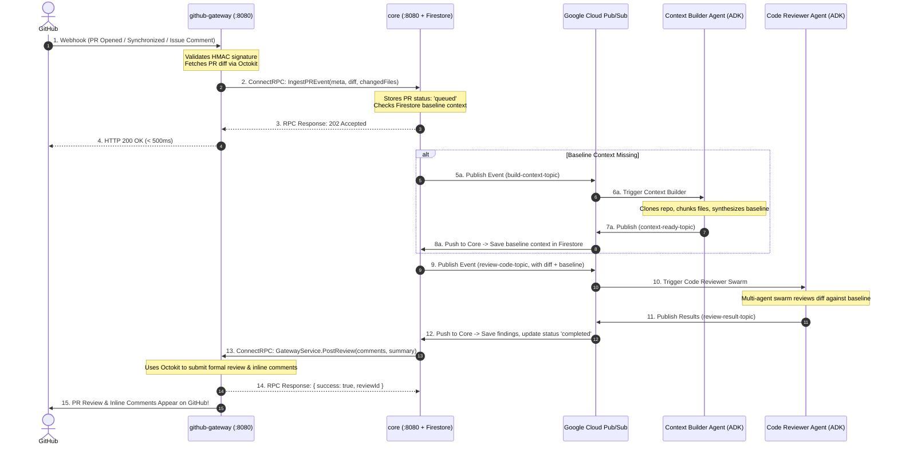

# Code Review Agent 🤖

A fully autonomous, context-aware AI Code Review system powered by [`@google/adk`](https://github.com/google/adk) and Google Gemini.

`code-review-agent` follows a decoupled, secure event-driven microservices architecture featuring provider-specific gateways (**`github-gateway`**), a centralized domain & persistence microservice (**`core`**), and two specialized AI agent microservices (**`agent-context-builder`** and **`agent-code-reviewer`**). Gateways are completely isolated from the database, communicating with Core via typed ConnectRPC, while heavy AI tasks run asynchronously over Google Cloud Pub/Sub.

---

## 🌟 Key Features

- **Strict Security Boundaries**: Gateways have zero database access or credentials. Core holds zero Git access tokens.
- **Pluggable Multi-Gateway Architecture**: Easily swap or add provider gateways (GitHub, GitLab, Bitbucket) implementing common ConnectRPC contracts.
- **Context-Aware Reviews**: Automatically generates and continuously updates a full baseline architectural context of your codebase to eliminate hallucinations.
- **Agentic Multi-Role Swarm**: Spawns parallel specialized reviewers (Code Quality, Bug Detection, Ticket Alignment) using `@google/adk`.
- **Top-Level Summaries & Inline Comments**: Submits formal pull request reviews alongside actionable inline review comments directly to the Git provider.
- **Fail-Fast Environment Configuration**: Strict validation with zero silent default fallbacks on required environment variables.
- **Container-First CI/CD**: Clean separation between application source code and private deployment operations. Multi-arch container images are automatically built and published to GHCR.

---

## 🏗️ Architecture


```mermaid
sequenceDiagram
    autonumber
    actor GitHub
    participant GW as github-gateway (:8080)
    participant Core as core (:8080 + Firestore)
    participant Bus as Google Cloud Pub/Sub
    participant CtxAgent as Context Builder Agent (ADK)
    participant RevAgent as Code Reviewer Agent (ADK)

    %% 1. Ingress
    GitHub->>GW: 1. Webhook (PR Opened / Synchronized / Issue Comment)
    Note over GW: Validates HMAC signature<br/>Fetches PR diff via Octokit
    GW->>Core: 2. ConnectRPC: IngestPREvent(meta, diff, changedFiles)
    Note over Core: Stores PR status: 'queued'<br/>Checks Firestore baseline context
    Core-->>GW: 3. RPC Response: 202 Accepted
    GW-->>GitHub: 4. HTTP 200 OK (< 500ms)

    %% 2. Context Orchestration
    alt Baseline Context Missing
        Core->>Bus: 5a. Publish Event (build-context-topic)
        Bus->>CtxAgent: 6a. Trigger Context Builder
        Note over CtxAgent: Clones repo, chunks files, synthesizes baseline
        CtxAgent->>Bus: 7a. Publish (context-ready-topic)
        Bus->>Core: 8a. Push to Core -> Save baseline context in Firestore
    end

    %% 3. Code Review
    Core->>Bus: 9. Publish Event (review-code-topic, with diff + baseline)
    Bus->>RevAgent: 10. Trigger Code Reviewer Swarm
    Note over RevAgent: Multi-agent swarm reviews diff against baseline
    RevAgent->>Bus: 11. Publish Results (review-result-topic)

    %% 4. Review Completion & Egress
    Bus->>Core: 12. Push to Core -> Save findings, update status 'completed'
    Core->>GW: 13. ConnectRPC: GatewayService.PostReview(comments, summary)
    Note over GW: Uses Octokit to submit formal review & inline comments
    GW-->>Core: 14. RPC Response: { success: true, reviewId }
    GW->>GitHub: 15. PR Review & Inline Comments Appear on GitHub!
```

---

## 📂 Repository Structure

This monorepo is managed with [Nx](https://nx.dev) and [pnpm](https://pnpm.io):

```
code-review-agent/
├── apps/
│   ├── github-gateway/          # Stateless GitHub webhook ingress & ConnectRPC egress
│   ├── github-gateway-e2e/      # Cucumber/Gherkin BDD integration tests for GitHub Gateway
│   ├── core/                    # Domain logic, Firestore persistence & Pub/Sub orchestration
│   ├── core-e2e/                # Cucumber/Gherkin BDD integration tests for Core
│   ├── agent-context-builder/   # ADK agent for repo indexing & baseline context
│   └── agent-code-reviewer/     # ADK agent for diff review & inline findings
├── libs/
│   ├── contracts/               # Protobuf schemas & ConnectRPC client/server contracts
│   └── shared-types/            # Common domain TypeScript interfaces & schemas
├── .github/
│   └── workflows/
│       ├── ci.yml               # Lint, typecheck, unit tests, E2E tests, build dry-runs
│       └── release.yml          # Builds & publishes multi-arch container images to GHCR
└── docker-compose.yml           # Complete local development stack with emulators
```

---

## 📦 Published Container Images

Every merge to `main` and version tag (`v*.*.*`) automatically publishes multi-architecture (`linux/amd64`, `linux/arm64`) images to GitHub Container Registry (GHCR):

| Service | Container Image | Description |
| :--- | :--- | :--- |
| **GitHub Gateway** | `ghcr.io/<owner>/code-review-agent-github-gateway:latest` | Stateless webhook receiver & ConnectRPC GitHub egress |
| **Core Service** | `ghcr.io/<owner>/code-review-agent-core:latest` | Firestore database state, workflow orchestration, ConnectRPC |
| **Context Builder** | `ghcr.io/<owner>/code-review-agent-context-builder:latest` | ADK agent for repo indexing & baseline context |
| **Code Reviewer** | `ghcr.io/<owner>/code-review-agent-code-reviewer:latest` | ADK agent for diff analysis & inline suggestions |

---

## 🚀 Quickstart: Local Development

You can run the entire system locally with Docker Compose, which includes Firestore and Pub/Sub emulators:

```bash
# 1. Clone the repository
git clone https://github.com/<owner>/code-review-agent.git
cd code-review-agent

# 2. Copy and customize the environment file
cp .env.example .env

# Edit .env with your Google Gemini API key and GitHub credentials:
# - GEMINI_API_KEY
# - GIT_ADAPTER_TOKEN
# - GIT_ADAPTER_WEBHOOK_SECRET

# 3. Start the entire stack
docker compose up --build
```

The services will be available locally:
- **GitHub Gateway**: `http://localhost:3000` (Healthcheck: `http://localhost:3000/healthz`)
- **Core Service**: `http://localhost:3001` (Healthcheck: `http://localhost:3001/healthz`)
- **Firestore Emulator**: `localhost:8081`
- **Pub/Sub Emulator**: `localhost:8085`

---

## 🏢 Production Deployment Strategy: Separate Private Ops Repo

### Why a Separate Private Deployment Repository?

This codebase is intentionally designed as an open-source / application repository that publishes versioned container images. We strongly recommend deploying via a **separate private repository** (e.g. `code-review-agent-deploy` or internal GitOps / infrastructure repo).

This approach provides:
1. **Security & Credential Isolation**: Keep cloud infrastructure credentials, service account keys, GitHub tokens, and `.env` secrets private.
2. **Infrastructure Independence**: Deploy to Google Cloud Run, GKE / Kubernetes (Helm / ArgoCD), AWS ECS, or self-hosted Docker Compose without modifying application code.
3. **Immutable Releases**: Pin deployments to specific immutable semantic tags (e.g. `:v1.2.0` or `:sha-<commit>`) published by this repository.

### Setting Up the Private Deployment Repository

A private deployment repository typically contains:

```
code-review-agent-deploy/ (Private Repo)
├── .github/workflows/
│   └── deploy.yml               # Deployment workflow (Cloud Run, K8s, or SSH/Docker)
├── environments/
│   ├── production.env           # Injected production secrets & config
│   └── staging.env
├── terraform/                   # Optional: GCP/AWS infrastructure provisioning
│   ├── firestore.tf
│   └── pubsub.tf
└── docker-compose.prod.yml       # Production Compose or Kubernetes manifests
```

#### Example 1: Deploying with Docker Compose in Private Repo

In your private deployment repo, create `docker-compose.prod.yml` referencing the pre-built GHCR images:

```yaml
version: '3.8'

services:
  github-gateway:
    image: ghcr.io/<owner>/code-review-agent-github-gateway:latest
    ports:
      - "80:8080"
    environment:
      - PORT=8080
      - HOST=0.0.0.0
      - CORE_URL=http://core:8080
      - GIT_ADAPTER=github
      - GIT_ADAPTER_WEBHOOK_SECRET=${GIT_ADAPTER_WEBHOOK_SECRET}
      - GIT_ADAPTER_TOKEN=${GIT_ADAPTER_TOKEN}
      - PUBSUB_SECRET_TOKEN=${PUBSUB_SECRET_TOKEN}
    depends_on:
      - core

  core:
    image: ghcr.io/<owner>/code-review-agent-core:latest
    environment:
      - PORT=8080
      - HOST=0.0.0.0
      - GATEWAY_URL=http://github-gateway:8080
      - PUBSUB_SECRET_TOKEN=${PUBSUB_SECRET_TOKEN}
      - BUILD_CONTEXT_TOPIC=build-context-topic
      - CONTEXT_READY_TOPIC=context-ready-topic
      - REVIEW_CODE_TOPIC=review-code-topic
      - REVIEW_RESULT_TOPIC=review-result-topic
      - GOOGLE_CLOUD_PROJECT=${GOOGLE_CLOUD_PROJECT}
    # Mount GCP service account credentials if running outside GCP:
    # volumes:
    #   - ./gcp-key.json:/secrets/gcp-key.json
    # environment:
    #   - GOOGLE_APPLICATION_CREDENTIALS=/secrets/gcp-key.json

  agent-context-builder:
    image: ghcr.io/<owner>/code-review-agent-context-builder:latest
    environment:
      - PORT=8080
      - CORE_URL=http://core:8080
      - REVIEW_MODEL=gemini-2.5-flash
      - GEMINI_API_KEY=${GEMINI_API_KEY}
      - CONTEXT_READY_TOPIC=context-ready-topic
      - GOOGLE_CLOUD_PROJECT=${GOOGLE_CLOUD_PROJECT}

  agent-code-reviewer:
    image: ghcr.io/<owner>/code-review-agent-code-reviewer:latest
    environment:
      - PORT=8080
      - CORE_URL=http://core:8080
      - REVIEW_MODEL=gemini-2.5-flash
      - GEMINI_API_KEY=${GEMINI_API_KEY}
      - REVIEW_RESULT_TOPIC=review-result-topic
      - PUBSUB_SECRET_TOKEN=${PUBSUB_SECRET_TOKEN}
      - GOOGLE_CLOUD_PROJECT=${GOOGLE_CLOUD_PROJECT}
```

#### Example 2: Deploying to Google Cloud Run in Private Repo

In your private deployment repo, create a GitHub Actions workflow that deploys the services and configures Pub/Sub push subscriptions:

```yaml
name: Deploy Code Review Agent to Cloud Run

on:
  workflow_dispatch:
  push:
    branches: [main]

jobs:
  deploy:
    runs-on: ubuntu-latest
    steps:
      - name: Authenticate to Google Cloud
        uses: google-github-actions/auth@v2
        with:
          credentials_json: ${{ secrets.GCP_SA_KEY }}

      - name: Set up Cloud SDK
        uses: google-github-actions/setup-gcloud@v2

      - name: Deploy Core Service
        run: |
          gcloud run deploy core-service \
            --image "ghcr.io/${{ vars.IMAGE_OWNER }}/code-review-agent-core:latest" \
            --region "${{ vars.GCP_REGION }}" \
            --platform managed \
            --no-allow-unauthenticated \
            --set-env-vars "PORT=8080,HOST=0.0.0.0,GATEWAY_URL=${{ vars.GATEWAY_URL }},BUILD_CONTEXT_TOPIC=build-context-topic,CONTEXT_READY_TOPIC=context-ready-topic,REVIEW_CODE_TOPIC=review-code-topic,REVIEW_RESULT_TOPIC=review-result-topic,PUBSUB_SECRET_TOKEN=${{ secrets.PUBSUB_SECRET_TOKEN }}"

      - name: Deploy GitHub Gateway
        run: |
          gcloud run deploy github-gateway \
            --image "ghcr.io/${{ vars.IMAGE_OWNER }}/code-review-agent-github-gateway:latest" \
            --region "${{ vars.GCP_REGION }}" \
            --platform managed \
            --allow-unauthenticated \
            --set-env-vars "PORT=8080,HOST=0.0.0.0,CORE_URL=${{ vars.CORE_URL }},GIT_ADAPTER_WEBHOOK_SECRET=${{ secrets.GIT_ADAPTER_WEBHOOK_SECRET }},GIT_ADAPTER_TOKEN=${{ secrets.GIT_ADAPTER_TOKEN }},PUBSUB_SECRET_TOKEN=${{ secrets.PUBSUB_SECRET_TOKEN }}"
```

---

## ⚙️ Environment Variables Reference

Each service strictly validates required variables and fails fast at startup if any are missing.

### GitHub Gateway (`apps/github-gateway`)

| Variable | Required | Description |
| :--- | :---: | :--- |
| `PORT` | Yes | Port to listen on (e.g. `8080`) |
| `HOST` | Yes | Host interface to bind to (e.g. `0.0.0.0`) |
| `CORE_URL` | Yes | HTTP base URL of the Core microservice for ConnectRPC communication |
| `GIT_ADAPTER_WEBHOOK_SECRET` | Yes | Secret string used to verify incoming GitHub webhook HMAC signatures |
| `GIT_ADAPTER_TOKEN` | Yes | GitHub Personal Access Token (classic with `repo` scope) for PR diffs & comments |
| `PUBSUB_SECRET_TOKEN` | Yes | Shared secret token for authenticating ConnectRPC requests from Core |

### Core Service (`apps/core`)

| Variable | Required | Description |
| :--- | :---: | :--- |
| `PORT` | Yes | Port to listen on (e.g. `8080`) |
| `HOST` | Yes | Host interface to bind to (e.g. `0.0.0.0`) |
| `GATEWAY_URL` | Yes | HTTP base URL of the Gateway microservice for ConnectRPC review posting |
| `PUBSUB_SECRET_TOKEN` | Yes | Shared secret token for authenticating ConnectRPC and internal push endpoints |
| `BUILD_CONTEXT_TOPIC` | Yes | Google Cloud Pub/Sub topic to publish context build requests to |
| `REVIEW_CODE_TOPIC` | Yes | Google Cloud Pub/Sub topic to publish code review tasks to |
| `CONTEXT_READY_TOPIC` | Optional | Google Cloud Pub/Sub topic for context ready notifications |
| `REVIEW_RESULT_TOPIC` | Optional | Google Cloud Pub/Sub topic for review result events |
| `GOOGLE_CLOUD_PROJECT` | Optional | GCP Project ID (auto-detected when running in GCP) |
| `FIRESTORE_EMULATOR_HOST`| Optional | Host of local Firestore emulator for dev/testing (e.g. `localhost:8081`) |
| `PUBSUB_EMULATOR_HOST` | Optional | Host of local Pub/Sub emulator for dev/testing (e.g. `localhost:8085`) |

### Context Builder Agent (`apps/agent-context-builder`)

| Variable | Required | Description |
| :--- | :---: | :--- |
| `PORT` | Yes | Port to listen on (e.g. `8080`) |
| `CORE_URL` | Yes | HTTP base URL of the Core microservice for fetching/saving context |
| `REVIEW_MODEL` | Yes | Gemini model identifier (e.g. `gemini-2.5-flash`) |
| `CONTEXT_READY_TOPIC` | Yes | Google Cloud Pub/Sub topic to publish completion event to |
| `GEMINI_API_KEY` | Optional | Google Gemini API key (required if not using Google Cloud ADC / Vertex AI) |
| `GOOGLE_GENAI_USE_VERTEXAI` | Optional | Set to `1` to authenticate via Google Cloud Vertex AI ADC |

### Code Reviewer Agent (`apps/agent-code-reviewer`)

| Variable | Required | Description |
| :--- | :---: | :--- |
| `PORT` | Yes | Port to listen on (e.g. `8080`) |
| `CORE_URL` | Yes | HTTP base URL of the Core microservice |
| `REVIEW_MODEL` | Yes | Gemini model identifier (e.g. `gemini-2.5-flash`) |
| `REVIEW_RESULT_TOPIC` | Yes | Google Cloud Pub/Sub topic to publish review findings to |
| `PUBSUB_SECRET_TOKEN` | Yes | Shared secret token for authenticating direct HTTP fallback to Core |
| `GEMINI_API_KEY` | Optional | Google Gemini API key (required if not using Google Cloud ADC / Vertex AI) |
| `GOOGLE_GENAI_USE_VERTEXAI` | Optional | Set to `1` to authenticate via Google Cloud Vertex AI ADC |

---

## 🔗 GitHub Webhook Configuration

In your GitHub repository (or organization) settings under **Webhooks** → **Add webhook**:
1. **Payload URL**: `https://<YOUR_GATEWAY_URL>/api/v1/webhooks`
2. **Content type**: `application/json`
3. **Secret**: Value matching `GIT_ADAPTER_WEBHOOK_SECRET`
4. **Events to trigger**:
   - `Pull requests`
   - `Issue comments`

---

## 🛠️ Monorepo Development Commands

```bash
# Install dependencies
pnpm install

# Run linting across all projects
pnpm run lint

# Run TypeScript typechecks across all projects
pnpm run typecheck

# Run unit tests across all projects
pnpm run test

# Run end-to-end BDD tests (Cucumber / Gherkin)
pnpm run e2e

# Build all microservices
pnpm run build

# Build individual Docker images locally
pnpm run docker:build:github-gateway
pnpm run docker:build:core
pnpm run docker:build:context-builder
pnpm run docker:build:code-reviewer
```

---

## 📄 License

MIT
